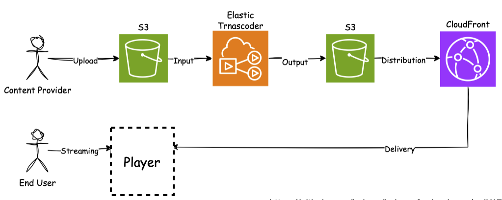
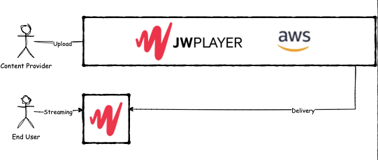
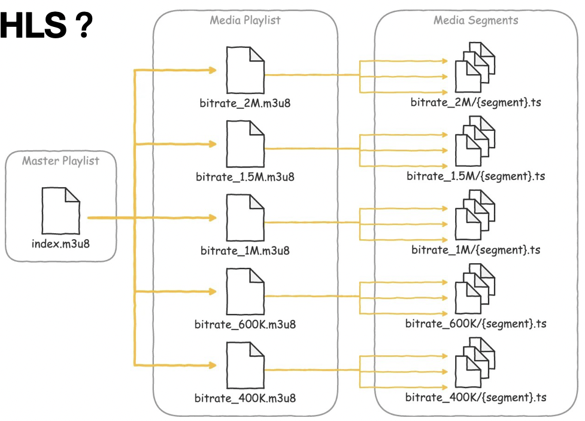
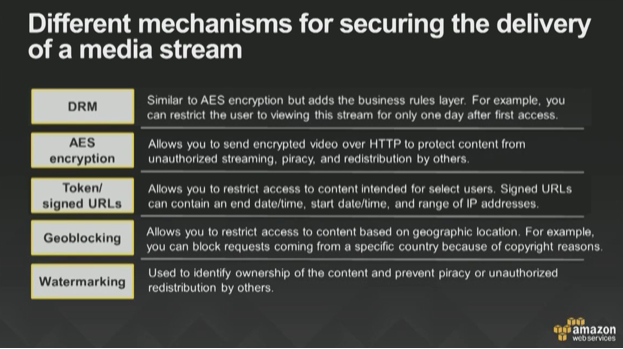
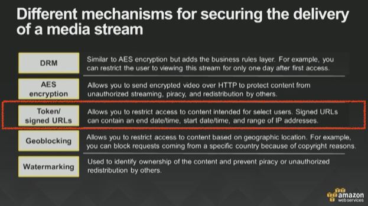
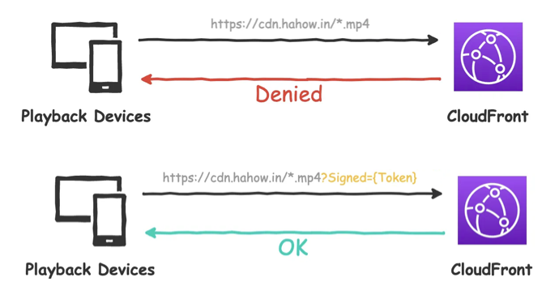
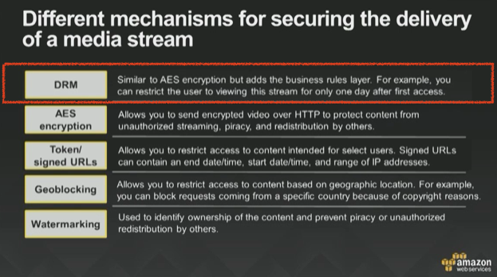
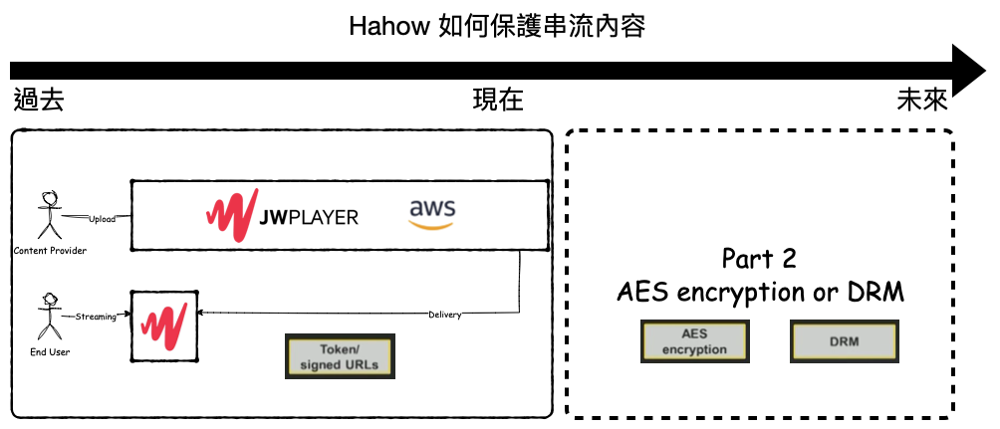
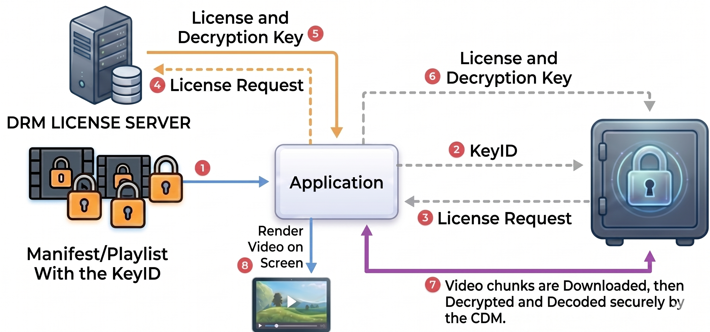
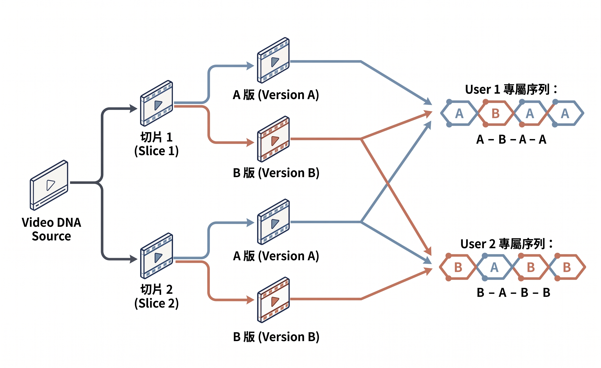

# Hahow 如何保護串流內容（下）

理解 DRM 數位版權管理：從 Widevine 到 FairPlay 的串流保護實務

<div class="abs-bl m-6 text-sm text-gray-400">
  Amo Wu · 2026-05-11
</div>

---
layout: center
---

# Recap

<div class="text-7xl font-bold">
VOD = Video On Demand
</div>

---

# Recap



---

# Recap



---

# Recap



---

# Recap



---

# Recap



---

# Recap



---

# Recap


---

# Recap



---

# Recap



---
layout: section
---

# 從一張黑畫面截圖說起

---

# 你遇過這個嗎？

<div class="grid grid-cols-2 gap-8 mt-8">
<div v-click>

### 想做的事
- 追 Netflix 熱門影集
- 想錄下精彩對白分享朋友
- 結果... 🖤

</div>
<div v-click>

### 其實是...

這不是手機壞了，也不是 App Bug

這是串流平台背後嚴密的

## **DRM 機制**
**Digital Rights Management 數位版權管理**

</div>
</div>

<!--
你是否曾有過這樣的經驗：在追 Netflix 的熱門影集或觀看 Disney+ 的最新大片時，看到一個絕美的畫面想截圖當桌布，或是想錄下一段精彩對白分享給朋友，結果截出來的圖卻是一片漆黑？

這並不是你的手機壞了，也不是 App 出了 Bug，而是串流平台背後那套嚴密的「數位版權管理」（Digital Rights Management，簡稱 DRM）機制在發揮作用。

身為負責公司學習平台 VOD 建置的工程師，我常被問到：在技術如此發達的今天，為什麼我們還能看到盜版資源？為什麼有些設備就是跑不出 4K？這背後其實是持續多年的技術拉鋸戰。本文將帶你拆解 DRM 的運作核心，並揭開 2026 年即將普及的 AI 隱形浮水印技術，看看這場防盜技術的攻防戰如何演進。
-->

---
layout: section
---

# DRM 不只是「加密」那麼簡單

<!--
很多人以為 DRM 就是把影片加密（Video Encryption），但本質上，它是一整套複雜的「密鑰管理系統」。
-->

---

# DRM vs 單純加密

<div class="grid grid-cols-2 gap-8 mt-6">
<div v-click>

### 單純加密
```
拿到鑰匙 → 解密 → 擁有檔案
可以：無限次播放、拷貝分享
```

</div>
<div v-click>

### DRM（數位版權管理）
```
有鑰匙，但...
- 只能看 24 小時
- 只能看 1080p
- 只能在台灣看
- 不能截圖、錄影
```

</div>
</div>

<div v-click class="mt-8 p-4 bg-blue-100 dark:bg-blue-900 rounded-lg">

DRM 更像一位「保全」：管你進屋後**能待多久、能不能拍照、能不能把東西帶走**

</div>

<!--
如果只有影片加密，一旦使用者拿到了鑰匙並解密，他就擁有了檔案，可以無限次播放或拷貝給別人。而 DRM 比較像是一位「保全」，它不僅管你有沒有鑰匙，還管你進屋後能待多久、能不能拍照、能不能把東西帶走。確保只有獲得授權的使用者，在受信任的環境下，才能取得那把解開影片的鑰匙。
-->

---
layout: section
---

# DRM 三核心機制

<!--
DRM 的運作包含三個核心機制：
-->

---

# CDM — Content Decryption Module

<div class="grid grid-cols-2 gap-8">
<div>

### 是什麼？
瀏覽器內建的**硬體/軟體沙盒**，負責真正的解密與渲染

### 為什麼截圖會變黑？
影像是在 CDM **內部**渲染的，完全繞過瀏覽器渲染層

> JavaScript 無法觸碰 CDM 內容——它是個「黑盒子」

</div>
<div v-click>

```
┌──────────────────────────┐
│        Browser           │
│  ┌────────────────────┐  │
│  │    JavaScript      │  │
│  │  (cannot access)   │  │
│  └─────────┬──────────┘  │
│            │ EME API     │
│  ┌─────────▼──────────┐  │
│  │   CDM (black box)  │◄─── screenshot stops here
│  │  decrypt + render  │  │
│  └────────────────────┘  │
└──────────────────────────┘
```

</div>
</div>

<!--
CDM（Content Decryption Module）：這是瀏覽器內置的一個硬體或軟體沙盒，負責真正的解密與渲染。由於它是個「黑盒子」，JavaScript 無法觸碰其內容，這就是為什麼截圖會變黑 —— 影像是在 CDM 內部渲染的，完全繞過了瀏覽器的渲染層。
-->

---

# License — 活的許可證

<div class="mt-6">

加密檔案本身是**死的**，但「許可證」是**活的**

</div>

<div class="grid grid-cols-3 gap-4 mt-6">
<div v-click class="p-4 bg-gray-100 dark:bg-gray-800 rounded-lg text-center">
  <div class="text-2xl mb-2">⏱️</div>
  <div class="font-bold">時間限制</div>
  <div class="text-sm text-gray-500 dark:text-gray-400 mt-2">這把鑰匙只能用 24 小時</div>
</div>
<div v-click class="p-4 bg-gray-100 dark:bg-gray-800 rounded-lg text-center">
  <div class="text-2xl mb-2">📺</div>
  <div class="font-bold">畫質限制</div>
  <div class="text-sm text-gray-500 dark:text-gray-400 mt-2">你只能看 1080p</div>
</div>
<div v-click class="p-4 bg-gray-100 dark:bg-gray-800 rounded-lg text-center">
  <div class="text-2xl mb-2">🌏</div>
  <div class="font-bold">地區限制</div>
  <div class="text-sm text-gray-500 dark:text-gray-400 mt-2">你的 IP 不符合版權範圍</div>
</div>
</div>

<div v-click class="mt-6 p-4 bg-yellow-100/80 dark:bg-yellow-900/50 rounded-lg">

**流程**：點擊播放 → CDM 向伺服器請求許可證 → 符合所有規則 → CDM 開鎖 → 播放

</div>

<!--
License：加密檔案本身是死的，但「許可證」是活的。當你點擊播放時，CDM 會向伺服器請求一張許可證，上面寫滿了限制規則：這把鑰匙只能用 24 小時、你只能看 1080p 的畫質、或者你現在的 IP 位置不符合版權範圍。只有當你符合清單上所有規則，CDM 才會為你點頭開鎖。
-->

---

# Hardware Enforcement — 硬體層防護

<div class="mt-6">

現代 DRM 不只靠軟體，直接與 CPU 和顯示晶片合作

</div>

<div v-click class="mt-6">

### HDCP（High-bandwidth Digital Content Protection）

```
DRM 偵測到不合格的投影機
        ↓
硬體層級直接切斷訊號
        ↓
畫面消失（不是軟體層的黑屏，而是真的沒有輸出）
```

</div>

<div v-click class="mt-6 p-4 bg-red-100/80 dark:bg-red-900/40 rounded-lg">

**封閉信任鏈**：瀏覽器 → 伺服器 → 硬體內部

即使你拿到了鑰匙，也無法反抗這些限制

</div>

<!--
Hardware Enforcement：現代 DRM 不只靠軟體，還直接與你的硬體（CPU 和顯示晶片）合作。例如透過 HDCP 協議，如果 DRM 發現你接了一個不合格的投影機，硬體層級會直接切斷訊號。

這種從瀏覽器到伺服器，再到硬體內部的「封閉信任鏈」，就是為什麼你即便設法拿到了鑰匙，也無法反抗這些限制的原因。
-->

---
layout: section
---

# 前端工程師必知的三個組件

<!--
了解了這三道安全防線後，身為前端工程師的我們還必須認識三個組件：
-->

---

# EME / MSE / PSSH

<div class="grid grid-cols-3 gap-6 mt-8">
<div v-click class="p-4 bg-blue-100/80 dark:bg-blue-900/50 rounded-lg">

### EME
**Encrypted Media Extensions**

W3C 標準 API

播放器 ↔ CDM 的**橋樑**

把密鑰請求傳給伺服器，再把許可證傳回 CDM

</div>
<div v-click class="p-4 bg-green-100/80 dark:bg-green-900/50 rounded-lg">

### MSE
**Media Source Extensions**

負責將下載的加密影片片段（Segments）源源不絕地餵入播放器

</div>
<div v-click class="p-4 bg-purple-100/80 dark:bg-purple-900/50 rounded-lg">

### PSSH
**Protection System Specific Header**

埋在影片流中的資訊

包含重要的**金鑰 ID（Key ID）**

沒有 PSSH，CDM 不知道需要哪把金鑰

</div>
</div>

<!--
* EME（Encrypted Media Extensions）：它是播放器與 CDM 之間的「橋樑」。作為 W3C 標準的 API，它負責將密鑰請求傳給伺服器，再把拿到的許可證傳回給 CDM。
* MSE（Media Source Extensions）：負責將下載下來的加密影片片段（Segments）源源不絕地餵入播放器中。
* PSSH（Protection System Specific Header）：這是埋在影片流中的資訊，包含了重要的「金鑰 ID（Key ID）」。沒有 PSSH，CDM 不知道需要哪把金鑰，也無法生成正確的 Challenge。
-->

---

# 架構圖

<div class="flex justify-center mt-4">
  
</div>

---
layout: section
---

# 三大主流陣營

Google × Apple × Microsoft

<!--
在實作 DRM 時，開發者最頭痛的就是跨平台兼容性，因為不同的瀏覽器與設備背後分別由三大巨頭把持：
-->

---

# 三大 DRM 方案對比

<div class="mt-6">

| DRM 方案 | 幕後大哥 | 主要環境 | 技術特點 |
|---------|---------|---------|---------|
| **Widevine** | Google | Chrome, Android, ChromeOS | 應用最廣，分 L1（硬體）到 L3（軟體） |
| **FairPlay** | Apple | Safari, iOS, macOS | 高度垂直整合，幾乎純硬體級，安全性極高 |
| **PlayReady** | Microsoft | Edge, Xbox, Windows | 歷史悠久，Smart TV 滲透率極高 |

</div>

<div v-click class="mt-6 p-4 bg-gray-100 dark:bg-gray-800 rounded-lg">

### Apple FairPlay 的特殊之處
Apple 掌控了從晶片（M/A 系列）→ OS → 瀏覽器的完整生態

解密工作徹底交給硬體層的 **Secure Enclave（安全隔離區）**

代價：完全不支援非 Apple 設備，Debug 出了名地麻煩

</div>

<!--
特別值得一提的是 Apple 的 FairPlay。由於 Apple 掌控了從晶片（M/A 系列）、作業系統到瀏覽器的完整生態，FairPlay 將解密工作徹底交給硬體層的「Secure Enclave（安全隔離區）」。這種封閉哲學使其安全性極高，但也讓它顯得相當「不合群」，不支援任何非 Apple 設備，甚至在開發調試上也是出了名的麻煩。
-->

---
layout: section
---

# 解析「畫質之謎」

為什麼我的裝置只能看 1080p？

<!--
你可能發現過，明明買了 Netflix 最高級的會員，但在一些手機或某些電腦瀏覽器上，畫質卻被限制在低畫質。這與 Widevine 的「強健度（Robustness）」等級有關。
-->

---

# Widevine 強健度（Robustness）等級

<div class="grid grid-cols-2 gap-8 mt-6">
<div v-click class="p-4 bg-green-100/80 dark:bg-green-900/50 rounded-lg">

### L1 — 硬體級保護
- 解密 + 解碼在硬體 **TEE** 中執行
- 片商高度信任 → 開放 **4K + HDR**
- 設備：支援 L1 的 Android 手機、電視

</div>
<div v-click class="p-4 bg-red-100/80 dark:bg-red-900/50 rounded-lg">

### L3 — 軟體級保護
- 解密在軟體層完成
- 較容易被逆向工程
- 片商通常只給 **720p / 1080p**

</div>
</div>

<div v-click class="mt-6 p-4 bg-yellow-100/80 dark:bg-yellow-900/50 rounded-lg">

### Chrome 悖論
即使你有一台**頂規 PC**，桌面版 Chrome 通常也只能看 1080p

Windows/macOS 的環境，Chrome 往往只能運行 L3

**Mac 要看 4K Netflix？請用 Safari！**（Google 近年在 Windows 導入 PlayReady 試圖打破此限制）

</div>

<!--
* Widevine L1：解密與解碼完全發生在硬體受信任執行環境（TEE）中。片商對此高度信任，因此願意開放 4K 與 HDR。
* Widevine L3：解密是在軟體層級完成的。對於駭客來說，軟體層較容易透過逆向工程破解，因此片商通常只給予低畫質以降低風險。

這裡有一個「Chrome 悖論」：即使你有一台價值十萬的頂規 PC，在桌面版 Chrome 上通常也只能看到 1080p 甚至更低。這是因為 Windows/macOS 的硬體解碼環境太雜，Chrome 往往只能運行 L3 軟體保護。這也是為什麼在 Mac 上想看 4K Netflix，你必須使用 Safari （Google 近年已在 Windows 平台上導入 Microsoft PlayReady 支援，試圖打破 4K 瓶頸）。
-->

---

# Widevine EME 實作範例

```js {1-13|15|17-27|42-43|29-40|all} {maxHeight:'380px'}
// 1. DRM 基本配置
const drmConfig = [{
  initDataTypes: ['cenc'],
  videoCapabilities: [{
    contentType: 'video/mp4; codecs="avc1.42E01E"',
    // 如果你強行要求 HW_SECURE_ALL（L1）
    // 但使用者設備僅支援 L3，播放器會直接報錯黑屏。
    // 專業的做法是偵測到失敗後，
    // 自動 Fallback 要求 SW_SECURE_DECODE（L3），
    // 至少讓用戶能看到低畫質的畫面。
    robustness: 'SW_SECURE_DECODE'
  }]
}];

const video = document.querySelector('video');

// 2. 監聽 'encrypted' 事件：這是獲取 PSSH 的標準入口
video.addEventListener('encrypted', async (event) => {  
  const pssh = event.initData; 

  // 3. 請求 CDM 存取權限
  const access = await navigator.requestMediaKeySystemAccess('com.widevine.alpha', drmConfig);
  const keys = await access.createMediaKeys();
  await video.setMediaKeys(keys);

  // 4. 建立解密會話
  const session = keys.createMediaKeySession();

  // 6. 處理 License 請求
  session.addEventListener('message', async (msgEvent) => {
    const response = await fetch('https://your-license-server.com/get-key', {
      method: 'POST',
      body: msgEvent.message
    });
    
    const license = await response.arrayBuffer();
    
    // 7. 將拿到的鑰匙塞入 CDM
    await session.update(license);
  });

  // 5. 告知 CDM 根據這段 PSSH 生成 Challenge
  await session.generateRequest(event.initDataType, pssh);
});
```

---
layout: section
---

# 開發者的噩夢

FairPlay 那極其「人工」的申請流程

<!--
實作 FairPlay 的過程通常比 Widevine 痛苦得多，因為它的流程充滿了「Apple 式」的嚴謹與人工審核：
-->

---

# FairPlay 申請流程

<div class="grid grid-cols-2 gap-8">
<div>

<v-clicks>

1. 申請 Apple 開發者組織帳號
1. 申請 FPS Deployment Package
1. Application Certificate
1. 換取 ASK ⚠️ 只會出現一次
1. 將證書、私鑰與 ASK 交付給播放器或後端

</v-clicks>

</div>
<div v-click>

### 血淚教訓

> 如果在專案上線前兩天才發現沒申請 FairPlay，絕對來不及

Apple 審核人員可能正在放假，這不是寫程式能解決的問題 😭

<hr class="my-4">

> HDMI 線的坑

用了不合格的 HDMI 線，FairPlay 會丟給你一個模糊的 `MediaError`，讓你 Debug 到懷疑人生

</div>
</div>

<!--
1. 申請與憑證：必須具備 Apple 開發者組織帳號，並申請 FPS Deployment Package。
2. Application Certificate：這是 FairPlay 的獨門要求。在發送 License 請求前，播放器必須先下載這個二進制憑證，否則 CDM 連密鑰請求都生不出來。
3. 換取 ASK：在 Apple 後台生成證書時，會產生一串 ASK（Application Secret Key）。
4. 警告：ASK 在網頁生成時「只會出現一次」，沒存下來就得全部重來。
5. 整合：將證書、私鑰與 ASK 交付給播放器或後端。

如果在專案上線前兩天你才發現沒申請 FairPlay，那是絕對來不及的。因為 Apple 的審核人員可能正在放假，這不是寫程式能解決的問題。此外，如果你用了一條不合格的 HDMI 線，FairPlay 會直接丟給你一個模糊的 MediaError，讓你調試到懷疑人生。
-->

---

# FairPlay 實作範例

```js {1-6|8-11|12-16|18-24|36-38|26-34|all} {maxHeight:'380px'}
// FairPlay 專屬：獲取 Application Certificate
async function fetchAppCert(certUrl) {
  const response = await fetch(certUrl);
  const arrayBuffer = await response.arrayBuffer();
  return new Uint8Array(arrayBuffer);
}

async function setupFairPlay(video, certUrl) {
  const appCert = await fetchAppCert(certUrl);

  video.addEventListener('encrypted', async (event) => {
    // 1. 取得 FairPlay 的 Key System
    const access = await navigator.requestMediaKeySystemAccess('com.apple.fps', [{
      initDataTypes: ['skd'], // FairPlay 常用 skd 或 sinf
      videoCapabilities: [{ contentType: 'video/mp4; codecs="avc1.42E01E"' }]
    }]);
    
    const keys = await access.createMediaKeys();
    
    // 2. 【關鍵點】必須先設定伺服器憑證
    await keys.setServerCertificate(appCert);
    await video.setMediaKeys(keys);

    const session = keys.createMediaKeySession();

    session.addEventListener('message', async (msgEvent) => {
      // 4. 發送 SPC (Server Playback Context，類似 License Request) 給 License Server
      const response = await fetch('your-fairplay-license-url', {
        method: 'POST',
        body: msgEvent.message
      });
      const ckc = await response.arrayBuffer(); // 回傳的是 CKC (Content Key Context，類似 License)
      await session.update(ckc);
    });

    // 3. FairPlay 的 initData 通常需要從 skd:// 轉換
    const initData = event.initData; 
    await session.generateRequest(event.initDataType, initData);
  });
}
```

---
layout: section
---

# 既然有 DRM，為什麼盜版還是有 4K 資源？

<!--
既然有 DRM，為什麼盜版平台還是有 4K 資源？
-->

---

# 三大盜版漏洞

<div class="mt-4">DRM 防的是「普通用戶」，而非「專業組織」</div>

<div class="grid grid-cols-3 gap-4 mt-6">
<div v-click class="p-4 bg-red-100/80 dark:bg-red-900/40 rounded-lg">

### 1. Widevine L3 漏洞
逆向工程提取**軟體層密鑰**

直接下載原始流並解密

稱為 **WEB-DL**

畫質無損，與原始檔一致

</div>
<div v-click class="p-4 bg-orange-900/40 rounded-lg">

### 2. HDCP 剝離
用特殊擷取卡**偽裝成合法顯示器**

在 HDMI 傳輸中剝離 HDCP

稱為 **WEB-Rip**

經過二次壓縮，細節略損

</div>
<div v-click class="p-4 bg-yellow-100/80 dark:bg-yellow-900/40 rounded-lg">

### 3. CDM 零日漏洞
發現瀏覽器解密模組的**未公開漏洞**

模擬合法 L1 設備索取 4K 密鑰

最難防，也最稀有

</div>
</div>

<div v-click class="mt-6 p-4 bg-gray-700/50 rounded-lg">

> DRM 就像家裡的門鎖，它防不了帶專業工具的盜賊，但它能確保路過的行人無法隨意進來搬東西。

</div>

<!--
儘管 DRM 很強，但它防的是「普通用戶」，而非「專業組織」。盜版資源主要透過三大漏洞流出：

1. Widevine L3 漏洞：駭客透過逆向工程提取軟體層密鑰，直接從伺服器下載原始流並解密。這稱為 WEB-DL（最高境界，畫質無損且與原始檔案一致）。
2. HDCP 剝離（Analog Hole）：利用特殊擷取卡偽裝成合法顯示器，在 HDMI 傳輸中剝離 HDCP 保護。這稱為 WEB-Rip（經過二次壓縮，細節略損）。
3. CDM 零日漏洞：專業組織發現瀏覽器解密模組的未公開漏洞，模擬合法 L1 設備索取 4K 密鑰。

為了提高安全性，Widevine 現在也引入了 Service Certificate（類似 FairPlay 的預先認證），讓 License 請求從第一步開始就是加密的，確保隱私不被截獲。

DRM 就像家裡的門鎖，它防不了帶專業工具的盜賊，但它能確保路過的行人無法隨意進來搬東西。
-->

---
layout: section
---

# 省時省力的秘密

DRM as a Service

<!--
為了不讓開發者深陷在 EME 實作的泥沼中，DRM as a Service 應運而生。以 JW Player Studio DRM 為例，它實現了高度封裝：
-->

---

# JW Player Studio DRM

<div class="grid grid-cols-3 gap-4 mt-6">

<v-click>
<div class="rounded-xl p-4 bg-blue-100 dark:bg-blue-900/40 border border-blue-300 dark:border-blue-600 h-full">

### 📦 CMAF 統一打包
同一份影片同時支援 Widevine、PlayReady、FairPlay

節省約 **66%** 存儲成本

</div>
</v-click>

<v-click>
<div class="rounded-xl p-4 bg-green-100 dark:bg-green-900/40 border border-green-300 dark:border-green-600 h-full">

### 🖥️ 前端極簡化
SDK 自動偵測環境：
- Safari → FairPlay
- Chrome → Widevine
- Windows → PlayReady

</div>
</v-click>

<v-click>
<div class="rounded-xl p-4 bg-purple-100 dark:bg-purple-900/40 border border-purple-300 dark:border-purple-600 h-full">

### 🔧 可擴充
透過 `licenseRequestFilter` 攔截請求，加入自定義 Token

</div>
</v-click>

</div>

<!--
* CMAF 統一打包：透過 CMAF（Common Media Application Format）技術，同一份影片檔案可以同時支援 Widevine、PlayReady 和 FairPlay，這為平台節省了約 66% 的存儲成本。
* 前端極簡化：播放器 SDK 會自動偵測環境。在 Safari 啟動 FairPlay，在 Chrome 啟動 Widevine，在 Windows 則啟用 PlayReady。
* 擴充性：若需要自備 License Server，開發者仍可透過 licenseRequestFilter 攔截請求，加入自定義的 Token 或 Header。
-->

---

# JW Player Studio DRM — 範例程式碼

```js {all} {maxHeight:'380px'}
jwplayer("video").setup({
  playlist: [
    {
      file: "video.mpd",
      drm: {
        widevine: { url: "..." },
        playready: {
          url: "...",
          licenseRequestFilter: (req) => { ... } // 自定義請求
        },
        
      }
    },
    {
      file: "video.m3u8",
      drm: {
        fairplay: {
          url: "...",
          certificateUrl: "...", // App 憑證
          processSpcurl: (spc) => { ... }, // 處理 skd 轉換
          licenseRequestFilter: (req) => { ... }
        }
      }
    }
  ]
});
```

<!--
如果你跟我所在的團隊一樣，原本就已經採用 JW Player 作為整套影片託管的解決方案，那麼直接使用它們的 Studio DRM 會是最順水推舟的選擇（JW Player 的 Delivery API 會直接給你完整的 playlist，連上面的程式碼都不用寫）。
-->

---
layout: section
---

# 並非全站皆兵

什麼情境才適合用 DRM？

---

# DRM 適用情境判斷

<div class="grid grid-cols-2 gap-8 mt-6">
<div>

### ✅ 適合 DRM

<v-clicks>

- 好萊塢電影（合約強制要求）
- **高價線上課程**（我們的使用情境）
- **企業機密培訓內容**（我們的使用情境）

</v-clicks>

</div>
<div>

### ❌ 不適合 DRM

<v-clicks>

- 行銷廣告（追求傳播量）
- 新聞影片
- UGC（用戶上傳內容）
- 免費試看片段

</v-clicks>

</div>
</div>

<div v-click class="mt-8 p-4 bg-blue-100/80 dark:bg-blue-900/40 rounded-lg">

### YouTube 的策略
一般影片不加密 → 利於傳播 ／ 電影租借 → 強制啟動 Widevine

**DRM 的握手（Handshake）會消耗大量伺服器運算成本**

</div>

<!--
DRM 的握手（Handshake）會消耗大量的伺服器運算成本，因此並非全站適用。

* 適合 DRM：好萊塢電影、高價線上課程、企業機密培訓。這些內容通常有合約強制要求。
* 不適合 DRM：行銷廣告、新聞、UGC（使用者上傳內容）。這些內容追求傳播量，DRM 反而會增加播放延遲並導致舊設備無法開啟。

YouTube 就是典型案例：一般影片不加密以利傳播，但電影租借則會強制啟動 Widevine 保護。
-->

---
layout: section
---

# 正在主流化

AI 隱形浮水印與 A/B 變體技術

<!--
正在主流化：AI 隱形浮水印與 A/B 變體技術
-->

---

# A/B 變體技術原理

<div class="grid grid-cols-2 gap-8 mt-4">
<div>

<v-clicks>

### Step 1 — 轉碼時生成 A/B 兩個版本
針對同一段 **2-6 秒**的片段生成兩個微小差異版本

### Step 2 — CDN 給予專屬序列
根據使用者 ID 組合序列
例如：A-B-A-A-B-B-A...

### Step 3 — AI 反向追蹤
即使翻拍、壓縮、裁切，也能回推 A/B 序列 → 精準鎖定 User ID

</v-clicks>

</div>

<div class="flex justify-center mt-4">
  
</div>

</div>

<!--
其核心是 「雲端 A/B 切換模式」：

1. 原理：轉碼時針對同一段 2–6 秒的片段生成 A、B 兩個微小差異版本。
2. 組合：CDN 根據使用者 ID 給予專屬序列（如 A-B-A-A-B…）。
3. 追蹤：AI 具備強大的 「抗畸變（Anti-distortion）」 能力。即使盜版影片被手機翻拍、嚴重壓縮或裁切，AI 依然能從像素中的微小擾動回推這段 A/B 序列，精準鎖定洩漏者的 User ID。
-->

---

# 為什麼需要 AI 隱形浮水印？<br><span class="text-xl text-gray-400 font-normal">Forensic Watermarking</span>

<div class="mt-4">DRM 的最後防線，解決 DRM 無法防禦的問題</div>

<div class="grid grid-cols-2 gap-8 mt-6">
<div v-click class="p-4 bg-green-100/80 dark:bg-green-900/40 rounded-lg border border-green-300 dark:border-green-700">

### ✅ DRM 能防的
- 網路截取
- 軟體破解
- 一般用戶非授權存取

</div>
<div v-click class="p-4 bg-red-100/80 dark:bg-red-900/40 rounded-lg border border-red-300 dark:border-red-700">

### ❌ DRM 防不了的
- **類比漏洞**：手機直接翻拍螢幕
- **L3 軟體提取**
- 已流出的檔案無法追蹤來源

</div>
</div>

<div v-click class="mt-6 p-4 bg-purple-100/80 dark:bg-purple-900/40 rounded-lg">

### AI 隱形浮水印能做什麼？

即使影片被**手機翻拍、嚴重壓縮或裁切**，AI 依然能從像素中的微小擾動，精準鎖定洩漏者的 **User ID**

</div>

<!--
無論是 WEB-DL 還是 WEB-Rip 檔案流出時，AI 隱形浮水印（Forensic Watermarking）是最後的防線。它甚至能防禦 DRM 無法解決的「類比漏洞（如手機翻拍）」。
-->

---

# A/B 變體技術效果

### 成本對比

| 方法 | 轉碼量 |
|-----|-------|
| 傳統個人浮水印 | 用戶數 × 影片數 |
| **A/B 變體技術** | **影片數 × 2** |

<div class="mt-4 p-3 bg-green-100/80 dark:bg-green-900/40 rounded">

無論有多少用戶，永遠只需要 **A、B 兩份版本**

</div>

<div v-click class="mt-4 p-4 bg-gray-100 dark:bg-gray-800 rounded-lg text-center">

以前：「這是別人傳的，不關我的事」

現在：「這是從**你的帳號**、在 **14:05 分**、用**某型號電視**看的時候流出的」

<!--
這套技術就像是給影片植入了「數位 DNA」。以前盜版者可以說：「這是別人在網路上傳的，不關我的事。」現在透過這套序列，平台可以非常有底氣地說：「這就是從你的帳號、在 14:05 分、用某型號電視看的時候流出的。」

傳統若要為每位使用者嵌入唯一浮水印，必須進行「使用者數量 x 影片數量」的獨立轉檔，這成本是完全不切實際的天文數字。相較之下，A/B 變體技術無論背後的使用者規模多大，永遠只需要預先輸出 A、B 兩份版本（影片數量 x 2）。

面對「合謀攻擊（Collusion Attack）」（駭客對比不同使用者影片來抹除浮水印），AI 嵌入的特徵是非線性的且分佈在不同頻域，使破解成本高到不符合經濟效益。
-->

</div>

---
layout: section
---

# 未來趨勢

WebAssembly DRM

---

# WebAssembly DRM

<div class="grid grid-cols-2 gap-8 mt-6">
<div>

<v-clicks>

### 現在的問題
DRM 受限於三大巨頭的 CDM
- Google Widevine
- Apple FairPlay
- Microsoft PlayReady

### Wasm DRM 帶來的改變
**自定義解密演算法**

跨瀏覽器一致性

不再依賴特定廠商的 CDM

**「軟體定義安全」**

</v-clicks>

</div>
<div v-click>

### 未來的混合安全架構

```
┌───────────────────────────────────────┐
│       Hybrid Security Architecture    │
├──────────────┬────────────────────────┤
│     DRM      │  Block illegal access  │
├──────────────┼────────────────────────┤
│ AI Watermark │  Trace leak source     │
├──────────────┼────────────────────────┤
│     Wasm     │  Unified security      │
└──────────────┴────────────────────────┘
```

</div>
</div>

<!--
WebAssembly DRM 正在興起。它讓服務商可以部署自定義的解密演算法，實現跨瀏覽器的一致性，不再受限於 Google、Microsoft 或 Apple 的 CDM，實現「軟體定義安全」的靈活性與自主權。

展望未來，主流的安全架構也許將是混合式的：DRM（攔截非法存取）+ AI 隱形浮水印（追蹤洩漏來源）+ Wasm（統一安全邏輯）。
-->

---
layout: section
---

# 總結

---

# 回顧今天的技術拉鋸戰

<v-clicks>

- **DRM 不只是加密**：CDM（沙盒）+ License（活的規則）+ 硬體強制執行
- **前端三組件**：EME（橋樑）+ MSE（餵流）+ PSSH（金鑰索引）
- **三大陣營**：Widevine（最廣）/ FairPlay（最安全但最難搞）/ PlayReady（最老）
- **畫質等級**：L1 硬體 → 4K 以上，L3 軟體 → 1080p 以下
- **盜版漏洞**：L3 逆向 / HDCP 剝離 / CDM 零日
- **AI 浮水印**：A/B 變體，追蹤到個人 User ID，連手機翻拍都躲不掉
- **未來趨勢**：WebAssembly DRM，擺脫三大巨頭的 CDM

</v-clicks>

<div v-click class="mt-6 p-4 bg-blue-100/80 dark:bg-blue-900/40 rounded-lg text-center">

安全性不在於「絕對不可破解」，而在於**不斷增加破解成本**

（前提是產品開發成本不會先讓老闆崩潰 😄）

<!--
從黑屏截圖到 AI 隱形浮水印，我們看到串流技術的演進始終圍繞著一個核心：安全性不在於「絕對不可破解」，而在於「不斷增加破解成本」（當然，前提是產品開發成本不會先讓老闆崩潰，畢竟安全性也是有邊際效益的）
-->

</div>

---
layout: center
class: text-center
---

# Q & A

<div class="text-gray-400 mt-4">
這場影像防盜的攻防拉鋸戰，顯然還沒有終點
</div>
