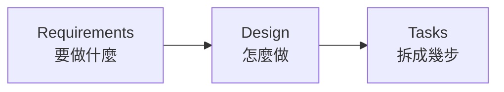
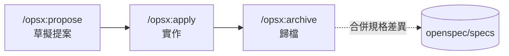

# OpenSpec

## 讓 AI 知道什麼叫「完成」

從 Vibe Coding 到規格驅動開發

<div class="abs-bl m-6 text-sm text-gray-400">
  Amo Wu · 2026-08-03
</div>

---
layout: section
---

# 1 · AI 說「我做完了」

---
layout: center
---

# 「我做完了」

<div class="text-4xl mt-8 text-gray-400">
  ——完成了什麼？
</div>

---

# Vibe Coding 的甜蜜

憑感覺寫程式，邊做邊想。而且它真的有效——在對的場景裡。

- **POC 驗證**　想法能不能成立，一個下午就知道
- **一次性小工具**　寫完就丟，沒有維護成本
- **技術探索**　不熟的函式庫，先跑起來再說

<div class="mt-8 text-gray-400">
  這些場景的共同點：專案小、只有你一個人、活不過下週。
</div>

---

# Vibe Coding 的危險

專案變大、需求變複雜、團隊變多人之後，三個問題會浮出來。

<v-clicks>

- **程式碼風格不一致**　同一個功能，這次用 hook、下次用 HOC
- **AI 漏掉你沒說出口的需求**　你以為的「當然要處理」，AI 不會主動問
- **AI 自信地宣稱完成**　「我做完了」——但邊界條件沒處理、測試沒補

</v-clicks>

---
layout: center
---

# 問題不在 AI 不夠強

<div class="text-2xl mt-6 text-gray-400">
  而在於，從頭到尾沒有人定義過
</div>

<div class="text-5xl mt-6 font-bold">
  什麼叫「完成」
</div>

---
layout: section
---

# 2 · SDD 是什麼

---

# SDD 不是新發明

Spec-Driven Development 的每一塊，我們其實都見過。

| 來源 | 借來的觀念 |
|---|---|
| 瀑布式開發 | 先把需求寫清楚再動工 |
| TDD | 先定義通過條件，再寫實作 |
| BDD | 用「當…則…」描述行為，而非實作細節 |

<div class="mt-8 text-gray-400">
  差別只在於：這次的讀者不只是人，還有 AI。
</div>

---
layout: center
---

# 規格是 AI 與人的共同語言

<div class="text-xl mt-8 text-gray-400">
  同一份文件，人拿來對齊認知，AI 拿來知道邊界在哪
</div>

---

# 三個階段

<v-clicks>



</v-clicks>

<div class="mt-8">

每一階段都是下一階段的輸入。跳過任何一段，後面就得靠猜。

</div>

---

# 階段一：Requirements

寫下**要做什麼**，以及**怎樣算做到了**。

```md
作為一個使用者，我希望能夠用 Email 和密碼登入，
這樣我就能存取我的個人資料。

驗收標準：
- 當使用者輸入正確的 Email 和密碼時，系統應將使用者導向首頁
- 當密碼錯誤超過三次時，系統應鎖定帳號三十分鐘
```

<div class="mt-6 text-gray-400">
  重點不是「使用者故事」這個格式，而是驗收標準——沒有它，「完成」就沒有定義。
</div>

---

# 階段二：Design

寫下**怎麼做**。目的是在寫程式之前就發現問題。

- 系統架構與資料流程
- 資料模型
- 錯誤處理策略
- 測試策略
- Wireframe（用 ASCII 畫也行）

<div class="mt-8 text-gray-400">
  在這一頁改一行字，比在程式碼裡改一天便宜。
</div>

---

# 階段三：Tasks

把工作拆成可追蹤的小任務。

- 每個任務有明確目標與驗收標準
- 每個任務能追溯回最初的需求
- 顆粒度因人而異——拆到「你有把握一次做對」為止

<div class="mt-8 text-gray-400">
  這份清單同時是進度表，也是 AI 的施工圖。
</div>

---

# EARS：讓需求可以被執行

**E**asy **A**pproach to **R**equirements **S**yntax

- 2009 年由 Alistair Mavin 與 Rolls-Royce 團隊提出
- Airbus、NASA、Siemens 等公司採用
- 目的：把自然語言需求壓縮成少數幾種固定句型

---

# EARS 的句型

```text
WHEN   the user enters correct email and password
THEN   the system SHALL redirect the user to the home page
```

<div class="mt-8">

`WHEN` 描述觸發條件，`THEN` 描述系統必須做的事，`SHALL` 表示這是強制要求。

</div>

---

# EARS 帶來的三件事

- **強迫需求明確化**　寫不出 `WHEN`，代表你還沒想清楚觸發條件
- **易於轉成測試**　一個 `WHEN / THEN` 就是一個測試案例
- **壓縮 AI 的猜測空間**　句型固定，語意就沒有解釋餘地

---

# SDD 的三個層級

不是所有人講的 SDD 都是同一件事。

```text
Spec-first      規格用完即丟
Spec-anchored   規格進版控，隨專案演進
Spec-as-source  程式碼完全由規格生成
```

---

# 三個層級的差別

| 層級 | 規格的下場 | 現況 |
|---|---|---|
| **Spec-first** | 實作完成後可丟棄 | 多數工具至少支援 |
| **Spec-anchored** | 進版控、持續更新；改功能先改規格 | 目前最務實 |
| **Spec-as-source** | 標記 `GENERATED FROM SPEC - DO NOT EDIT` | 仍在實驗階段 |

---
layout: center
---

# 今天談的是第二層

<div class="text-5xl mt-6 font-bold">
  Spec-anchored
</div>

<div class="text-xl mt-8 text-gray-400">
  規格進版控、隨專案演進，新人可以先讀規格再讀程式碼
</div>

---
layout: section
---

# 3 · 為什麼是 OpenSpec

---

# 工具地景

<div class="text-sm">

| 工具 | 工作流 | 特色 | 定位 |
|---|---|---|---|
| **Amazon Kiro** | Requirements → Design → Tasks | EARS、property-based testing、Hooks | Spec-first 為主 |
| **GitHub Spec Kit** | Constitution → Specify → Plan → Tasks | Constitution 定義原則、高度可客製 | Spec-first |
| **Tessl** | Plan / Spec / Test | 免費 Spec Registry，逾一萬個 OSS 用法規格 | 主打 Spec-as-source |
| **OpenSpec** | proposal → apply → archive | `specs` 與 `changes` 分離、純 Markdown | Spec-anchored |

</div>

---

# Greenfield 還是 Brownfield？

<div class="grid grid-cols-2 gap-8 mt-8">
<div>

### Greenfield

全新專案，沒有包袱。
從第一天就能把規格寫好。

</div>
<div>

### Brownfield

既有系統，滿地隱性規則。
改一個地方，得先知道會碰到什麼。

</div>
</div>

<div class="mt-10 text-center text-2xl">
  我們是後者。
</div>

---

# OpenSpec 的取捨

- **Brownfield-first**　`specs`（現在的系統長怎樣）與 `changes`（這次要改什麼）分離，強迫思考「這次變更會影響什麼」
- **全部是 Markdown**　進版控、走 PR review、不需要學新格式
- **不需要 API key**　不依賴雲端服務，沒有額外成本與資安評估
- **不綁 AI 工具**　Claude Code、Cursor、GitHub Copilot、Codex、Gemini CLI 都能用

---

# 我們試過 Spec Kit

`specs/001-time-basis-filter/` 還留在 repo 裡——只有這一個 feature。

```plain
specs/001-time-basis-filter/
├── checklists/requirements.md
├── data-model.md
├── plan.md
├── research.md
├── spec.md
└── tasks.md
```

<div class="mt-6 text-gray-400">
  六份文件、一次功能。流程完整，但對「改既有系統」這件事幫助有限——
  它沒有回答「現在的系統長怎樣」。
</div>

---
layout: section
---

# 4 · 實戰：三個指令

---

# 安裝與初始化

```bash
npm install -g @fission-ai/openspec@latest
cd my-project
openspec init
```

初始化後的結構：

```plain
openspec/
├── config.yaml
├── specs/      # 系統現在長什麼樣（正式規格）
└── changes/
    └── archive/  # 已完成的變更
```

---

# 三個指令



<div class="mt-6 text-gray-400">
  另有 <code>/opsx:explore</code> 用於動手前先摸清既有實作。
</div>

---

# Stage 1 · propose

```bash
/opsx:propose 測驗支援複選題
```

產出一個變更資料夾：

```plain
openspec/changes/2026-06-26-quiz-multiple-choice/
├── proposal.md   # 為什麼做、改什麼、影響什麼
├── design.md     # 技術決策與取捨
├── tasks.md      # 拆好的任務清單
└── specs/        # 這次變更對規格的 delta
```

---

# proposal.md · Why

<div class="text-xs">

```md
## Why

平台測驗目前只支援「單選題」，學員每題只能選一個答案，無法評估需要
同時掌握多個正確觀念的情境（法規確認、多步驟流程判斷、安全操作規範）。
後端已預先實作複選題的資料模型與評分邏輯，前端 Admin 也已寫好 Checkbox UI
但暫時封印待開放——本次為「解除封印」，補上缺失的 Admin 設置與學員端
作答／結果頁呈現。
```

</div>

<div class="mt-4 text-gray-400 text-sm">
  來源：<code>openspec/changes/archive/2026-06-26-quiz-multiple-choice/proposal.md</code>
</div>

---

# proposal.md · What Changes

<div class="text-xs">

```md
- **Admin 題目編輯**：解除封印「＋ 複選題」新增按鈕與每道題目的
  「題目類型」Select（單選 ↔︎ 複選）；複選題以 Checkbox 標示多個正確答案、
  單選題維持 Radio（現有行為）。
- **Admin 送出驗證**：複選題至少須標示一個正確答案；選項至少保留 2 個。
- **學員端作答頁**：複選題以 Checkbox 呈現、可同時勾選／取消多個選項，
  並在題號旁顯示「複選」標籤。
- **範圍界定**：本次僅實作 Web（Admin + 學員端）；App 由 mobile 團隊另行實作。
  前端不自行計算分數，僅呈現後端回傳的分數與各選項結果。
```

</div>

<div class="mt-4 text-gray-400 text-sm">
  注意最後一段——<strong>寫下不做什麼</strong>，跟寫下要做什麼一樣重要。
</div>

---

# proposal.md · Capabilities

這一段決定了 delta 要寫進哪幾份規格。

<div class="text-xs">

```md
### New Capabilities
- `quiz-question-editor`: Admin 測驗單元編輯頁的題目編輯能力——新增題目
  （單選／複選）、題目類型切換、選項管理與正確答案標示、送出前驗證。

### Modified Capabilities
- `quiz-taking-page`: 新增複選題作答行為——Checkbox 多選/取消、「複選」
  題型標籤、含複選題的送出按鈕啟用條件、複選 choiceIds 提交格式。
- `quiz-result-page`: 新增複選題結果呈現——四象限選項上色、全對全錯
  badge、「正確答案」純文字區塊。
```

</div>

---

# 對應的 specs 結構

一個 capability 一個資料夾，各自一份 `spec.md`。

```plain
openspec/changes/2026-06-26-quiz-multiple-choice/specs/
├── quiz-question-editor/spec.md   # ADDED
├── quiz-taking-page/spec.md       # MODIFIED
└── quiz-result-page/spec.md       # MODIFIED
```

<div class="mt-8 text-gray-400">
  跨模組的變更不會被壓成一份大文件，而是各自落在它影響的能力上。
</div>

---

# Delta 格式

變更的規格不是重寫整份，而是描述「差異」。

<v-clicks>

```md
## ADDED Requirements
### Requirement: 新增題目按鈕支援單選與複選
```

```md
## MODIFIED Requirements
### Requirement: 依題目類型渲染選項元件
（寫出完整的修改後內容，不是只寫改動處）
```

```md
## REMOVED Requirements
### Requirement: Password Reset via Email
**Reason**: 改用更安全的驗證方式
```

</v-clicks>

---

# Scenario 的寫法

每個 Requirement **至少要有一個 Scenario**，強制性用 `SHALL` 或 `MUST`。

<div class="text-xs">

```md
### Requirement: 複選題顯示「複選」題型標籤

作答頁 SHALL 在複選題「問題 n」（題號）右側、同列顯示「複選」標籤；
單選題 SHALL NOT 顯示題型標籤。

#### Scenario: 複選題顯示「複選」標籤（AC-EXAM-03）

- **WHEN** 學員進入作答頁且測驗包含複選題
- **THEN** 系統應在複選題「問題 n」右側顯示「複選」標籤，單選題不顯示
```

</div>

<div class="mt-4 text-gray-400 text-sm">
  來源：<code>.../quiz-multiple-choice/specs/quiz-taking-page/spec.md</code>　括號裡的
  <code>AC-EXAM-03</code> 是 PRD 的驗收條件編號——規格可以直接追溯回需求。
</div>

---

# Stage 2 · apply

```bash
/opsx:apply quiz-multiple-choice
```

AI 依 `tasks.md` 逐項完成，做完一項勾一項。

<div class="text-xs mt-4">

```md
## 1. GraphQL 契約與型別

- [x] 1.1 學員端 gql 的三處 questions 補上 questionType
- [x] 1.2 responses 由 myChoice/correctChoice 改為 myChoices、correctChoices
- [x] 1.3 submitQuizPaper mutation 改以 ResponseInput.choiceIds 提交
- [x] 1.4 執行 yarn generate 並修正衍生型別錯誤
```

</div>

<div class="mt-4 text-gray-400 text-sm">
  規格在實作途中發現不對，就當場改規格——這是流程的一部分，不是失誤。
</div>

---

# Stage 3 · archive

```bash
/opsx:archive quiz-multiple-choice
```

做兩件事：

- 把變更資料夾移進 `openspec/changes/archive/`
- 把 delta 合併回 `openspec/specs/`，成為系統的新現況

```plain
openspec/specs/
├── quiz-question-editor/spec.md   ← 新增
├── quiz-taking-page/spec.md       ← 更新
└── quiz-result-page/spec.md       ← 更新
```

---

# 另一個極端

不是每個提案都是 31 個 task。

<div class="text-xs">

```md
## Why

班次列表頁的「自動偵測狀態」篩選下拉，與表格欄位 AutoDetectionStatusCell
對相同狀態使用了不一致的文案：篩選器顯示「尚未開始／已結束／已結束（異常）」，
但欄位實際渲染「未開始／已停止／已停止＋異常」。同一狀態出現兩種說法會造成
使用者困惑。本次將篩選器文案對齊欄位的命名。
```

</div>

<div class="mt-4">

`2026-06-11-align-auto-detection-filter-labels`：**7 個 task、1 份 spec、純文案調整**。
同一套流程，從改三個下拉選單到 52 個 task 的大功能都撐得住。

</div>

---

# 什麼時候不需要提案？

判斷標準：**這次改動會不會讓系統行為跟 `specs` 裡寫的不一樣。**

不需要提案的情況：

- 修 bug（讓程式**符合**既有規格）
- 修錯字、調整格式
- 更新非破壞性的相依套件
- 為現有行為補測試

<div class="mt-6">

常用指令：

```bash
openspec list                      # 進行中的變更
openspec show <name>               # 看細節
openspec validate <name> --strict  # 檢查格式
openspec view                      # 互動式儀表板
```

</div>

---
layout: section
---

# 5 · 現實：spec 不是銀彈

---
layout: section
---

# 6 · 怎麼開始

---
layout: center
---

# References

<div class="text-sm text-left">

- 高見龍，[SDD 規格驅動開發](https://kaochenlong.com/sdd-spec-driven-development)
- 高見龍，[OpenSpec 讓 SDD 變簡單的三個指令](https://kaochenlong.com/openspec)
- 高見龍，[Spec-as-source 的理想與現實](https://kaochenlong.com/sdd-spec-as-source)
- 高見龍，[給 AI 超能力？Superpowers 的設計與取捨](https://kaochenlong.com/ai-superpowers-skills)

<br>

- [OpenSpec](https://github.com/Fission-AI/OpenSpec) · `@fission-ai/openspec`
- [Superpowers](https://github.com/obra/superpowers)

</div>
