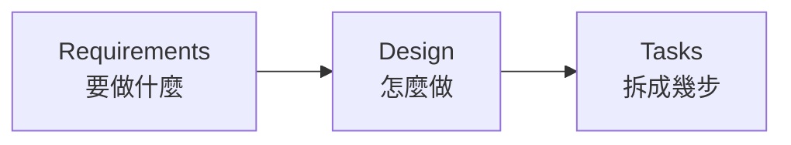
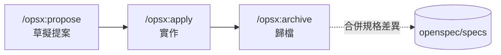

# OpenSpec

## 讓 AI 知道什麼叫「完成」

從 Vibe Coding 到規格驅動開發

<div class="abs-bl m-6 text-sm text-gray-400">
  Amo Wu · 2026-08-03
</div>

<!--
大家好，今天想跟大家分享的是 OpenSpec，一套規格驅動開發的工具。

先說結論：這不是一個「又要多學一個新工具」的分享。我們團隊在 hahow-for-business-frontend 上已經用了三個月，累積了十六個變更，今天是把這段實踐整理出來給大家看。
-->

---

# 今天的路線

<div class="text-lg mt-6">

| | | |
|---|---|---|
| **1** | AI 說「我做完了」 | 3 min |
| **2** | SDD 是什麼 | 6 min |
| **3** | 為什麼是 OpenSpec | 3 min |
| **4** | 實戰：三個指令 | 8 min |
| **5** | 現實：spec 不是銀彈 | 3 min |
| **6** | 怎麼開始 | 2 min |

</div>

<div class="mt-6 text-gray-400">
  前半段建立觀念，第 4 章是重點，第 5 章談限制——那一段可能比前面都重要。
</div>

<!--
整場大概二十五分鐘，路線是這樣。

前面三章建立觀念：痛點、SDD 是什麼、為什麼在一堆工具裡選 OpenSpec。

第四章是重點，八分鐘，我會用我們自己的變更紀錄把三個指令走一遍。

第五章談限制。我想特別說一下這一章——它不是免責聲明，我認為那一段可能比前面都重要，因為它會決定你對這套流程的期待對不對。期待錯了，導入一定會失敗。

最後兩分鐘講怎麼開始。

中間有問題隨時打斷我都可以。
-->

---
layout: section
---

# 1 · AI 說「我做完了」

<!--
我們先從一個大家應該都很熟悉的場景開始。
-->

---
layout: center
---

# 「我做完了」

<div class="text-4xl mt-8 text-gray-400">
  ——完成了什麼？
</div>

<!--
這句話，我相信在座每一位這禮拜都看過至少一次。

AI 跑完，跟你說「我做完了」。你打開 PR 一看，功能是有，但欄位驗證沒做、錯誤狀態沒處理、測試也沒補。

問題是——它到底完成了什麼？這句話從來沒有被定義過。
-->

---

# Vibe Coding 的甜蜜

憑感覺寫程式，邊做邊想。而且它真的有效——在對的場景裡。

- **POC 驗證**　想法能不能成立，一個下午就知道
- **一次性小工具**　寫完就丟，沒有維護成本
- **技術探索**　不熟的函式庫，先跑起來再說

<div class="mt-8 text-gray-400">
  這些場景的共同點：專案小、只有你一個人、活不過下週。
</div>

<!--
先講清楚，我不是要說 vibe coding 不好。

它在對的場景真的很有效率。你要驗證一個想法能不能成立，一個下午就有答案；寫個一次性小工具，寫完就丟，根本沒有維護成本；碰到不熟的函式庫，先叫 AI 跑起來再說，比讀文件快。

但你注意這三個場景的共同點：專案小、只有你一個人、而且這段程式碼活不過下週。

一旦這三個條件有任何一個不成立，狀況就變了。
-->

---

# Vibe Coding 的危險

專案變大、需求變複雜、團隊變多人之後，三個問題會浮出來。

<v-clicks>

- **程式碼風格不一致**　同一個功能，這次用 hook、下次用 HOC
- **AI 漏掉你沒說出口的需求**　你以為的「當然要處理」，AI 不會主動問
- **AI 自信地宣稱完成**　「我做完了」——但邊界條件沒處理、測試沒補

</v-clicks>

<!--
專案變大、需求變複雜、團隊變多人之後，三個問題會浮出來。

第一個，風格不一致。同一種功能，這次 AI 用 hook、下次用 HOC，兩個禮拜後你自己回來看都認不出是同一個 codebase。

第二個，也是最痛的——AI 會漏掉你沒說出口的需求。你心裡覺得「這個當然要處理啊」，但你沒寫出來，AI 就不會做，而且它也不會主動問你。

第三個，它會很有自信地告訴你做完了。這不是 AI 在騙你，是因為從頭到尾沒有人告訴它「完成」的標準是什麼。
-->

---
layout: center
---

# 問題不在 AI 不夠強

<div class="text-2xl mt-6 text-gray-400">
  而在於，從頭到尾沒有人定義過
</div>

<div class="text-5xl mt-6 font-bold">
  什麼叫「完成」
</div>

<!--
所以我想強調的是：這個問題不是換一個更強的模型就會解決的。

換 Opus、換 Gemini、換下一代，只要你沒有定義什麼叫完成，它就只能猜。模型越強，猜得越像真的，你越難發現它漏了什麼。

問題在流程，不在模型。
-->

---
layout: section
---

# 2 · SDD 是什麼

<!--
那要怎麼定義「完成」？這就是 SDD 在談的事。
-->

---

# SDD 不是新發明

Spec-Driven Development 的每一塊，我們其實都見過。

| 來源 | 借來的觀念 |
|---|---|
| 瀑布式開發 | 先把需求寫清楚再動工 |
| TDD | 先定義通過條件，再寫實作 |
| BDD | 用「當…則…」描述行為，而非實作細節 |

<div class="mt-8 text-gray-400">
  差別只在於：這次的讀者不只是人，還有 AI。
</div>

<!--
Spec-Driven Development，規格驅動開發。名字聽起來很新，但拆開看，每一塊我們都見過。

「先把需求寫清楚再動工」是瀑布式開發的老話。「先定義通過條件，再寫實作」就是 TDD。「用當什麼、則什麼來描述行為」是 BDD。

所以它不是什麼新發明，是把這些既有觀念重新組合。

真正的差別只有一個：以前這些文件是寫給人看的，現在多了一個讀者，是 AI。而 AI 對模糊的容忍度，比人低很多。
-->

---
layout: center
---

# 規格是 AI 與人的共同語言

<div class="text-xl mt-8 text-gray-400">
  同一份文件，人拿來對齊認知，AI 拿來知道邊界在哪
</div>

<!--
這是 SDD 最核心的定位：規格是人跟 AI 的共同語言。

同一份文件，兩種用途。人拿它來對齊認知——PM、設計、工程師看的是同一份東西，不會各自想像。AI 拿它來知道邊界在哪，知道什麼該做、什麼不該做。

一份文件，兩邊都受益。
-->

---

# 三個階段

<v-clicks>



</v-clicks>

<div class="mt-8">

每一階段都是下一階段的輸入。跳過任何一段，後面就得靠猜。

</div>

<!--
SDD 的標準流程有三個階段。

Requirements，要做什麼。Design，怎麼做。Tasks，拆成幾步。

重點在箭頭：每一階段都是下一階段的輸入。你跳過 Requirements 直接寫 Design，那 Design 就是建立在你腦補的需求上；跳過 Design 直接拆 Tasks，那 Tasks 就是憑感覺拆的。

跳過任何一段，後面都得靠猜。
-->

---

# 階段一：Requirements

寫下**要做什麼**，以及**怎樣算做到了**。

```md
作為一個使用者，我希望能夠用 Email 和密碼登入，
這樣我就能存取我的個人資料。

驗收標準：
- 當使用者輸入正確的 Email 和密碼時，系統應將使用者導向首頁
- 當密碼錯誤超過三次時，系統應鎖定帳號三十分鐘
```

<div class="mt-6 text-gray-400">
  重點不是「使用者故事」這個格式，而是驗收標準——沒有它，「完成」就沒有定義。
</div>

<!--
第一階段，Requirements。寫下要做什麼，以及——這個更重要——怎樣算做到了。

上面這段是常見的使用者故事格式。但我想請大家注意的不是這個格式，而是下面的驗收標準。

「密碼錯誤超過三次時，鎖定帳號三十分鐘」——如果沒有這一行，AI 做出來的登入功能就是不會有這個行為。它不會問你，因為你沒提。

驗收標準才是「完成」的定義。沒有它，前面那段使用者故事只是一段願望。
-->

---

# 階段二：Design

寫下**怎麼做**。目的是在寫程式之前就發現問題。

- 系統架構與資料流程
- 資料模型
- 錯誤處理策略
- 測試策略
- Wireframe（用 ASCII 畫也行）

<div class="mt-8 text-gray-400">
  在這一頁改一行字，比在程式碼裡改一天便宜。
</div>

<!--
第二階段，Design。寫下怎麼做。

架構、資料流、資料模型、錯誤處理、測試策略，需要的話畫個 wireframe，用 ASCII 畫都行。

這一階段的目的只有一個：在寫程式之前就把問題找出來。

我自己的體感是，在這份文件裡改一行字，比在程式碼裡改一整天便宜太多。而且 AI 寫程式的速度越快，這件事的價值越高——因為錯誤的方向也會被快速地實作出來。
-->

---

# 階段三：Tasks

把工作拆成可追蹤的小任務。

- 每個任務有明確目標與驗收標準
- 每個任務能追溯回最初的需求
- 顆粒度因人而異——拆到「你有把握一次做對」為止

<div class="mt-8 text-gray-400">
  這份清單同時是進度表，也是 AI 的施工圖。
</div>

<!--
第三階段，Tasks，把工作拆成可追蹤的小任務。

每個任務要有明確目標跟驗收標準，而且能追溯回最初的需求——這樣你才知道每一步是為了滿足哪一條。

顆粒度沒有標準答案，因人而異。我的判準是：拆到你有把握一次做對為止。

這份清單有兩個身分：對你來說是進度表，對 AI 來說是施工圖。
-->

---

# EARS：讓需求可以被執行

**E**asy **A**pproach to **R**equirements **S**yntax

- 2009 年由 Alistair Mavin 與 Rolls-Royce 團隊提出
- Airbus、NASA、Siemens 等公司採用
- 目的：把自然語言需求壓縮成少數幾種固定句型

<!--
講到寫需求，有一個格式值得認識，叫 EARS。

全名是 Easy Approach to Requirements Syntax。2009 年由 Alistair Mavin 跟 Rolls-Royce 的團隊提出來的，後來 Airbus、NASA、Siemens 這些公司都在用。

它的目的很單純：把自然語言的需求，壓縮成少數幾種固定句型。

會用在飛機引擎跟太空任務上，你就知道它要處理的是什麼等級的「不能有歧義」。
-->

---

# EARS 的句型

```text
WHEN   the user enters correct email and password
THEN   the system SHALL redirect the user to the home page
```

<div class="mt-8">

`WHEN` 描述觸發條件，`THEN` 描述系統必須做的事，`SHALL` 表示這是強制要求。

</div>

<!--
句型長這樣。

WHEN，描述觸發條件。THEN，描述系統必須做的事。中間的 SHALL 是關鍵字，表示這是強制要求，不是建議。

看起來很囉唆對不對？但你試著把它改寫成「使用者登入後導到首頁」，你就會發現：登入失敗呢？密碼對但帳號被鎖呢？

固定句型的價值就在這裡——它逼你把條件講出來。
-->

---

# EARS 帶來的三件事

- **強迫需求明確化**　寫不出 `WHEN`，代表你還沒想清楚觸發條件
- **易於轉成測試**　一個 `WHEN / THEN` 就是一個測試案例
- **壓縮 AI 的猜測空間**　句型固定，語意就沒有解釋餘地

<!--
所以 EARS 帶來三件事。

第一，強迫需求明確化。如果你寫不出 WHEN，那代表你自己都還沒想清楚觸發條件是什麼——這時候發現，比實作到一半發現好。

第二，容易轉成測試。一個 WHEN / THEN 幾乎就是一個測試案例，直接對應。

第三，壓縮 AI 的猜測空間。句型固定，語意就沒有解釋餘地，AI 不用猜你的意思。
-->

---

# SDD 的三個層級

不是所有人講的 SDD 都是同一件事。

```text
Spec-first      規格用完即丟
Spec-anchored   規格進版控，隨專案演進
Spec-as-source  程式碼完全由規格生成
```

<!--
接下來這件事很重要，因為它會決定你對 SDD 的期待對不對。

不是所有人講的 SDD 都是同一件事，它至少有三個層級。

Spec-first，規格用完即丟。Spec-anchored，規格進版控、隨專案演進。Spec-as-source，最激進的，程式碼完全由規格自動生成。

你在網路上看到有人說 SDD 很神、有人說 SDD 是幻覺，很多時候是因為他們講的根本是不同層級。
-->

---

# 三個層級的差別

| 層級 | 規格的下場 | 現況 |
|---|---|---|
| **Spec-first** | 實作完成後可丟棄 | 多數工具至少支援 |
| **Spec-anchored** | 進版控、持續更新；改功能先改規格 | 目前最務實 |
| **Spec-as-source** | 標記 `GENERATED FROM SPEC - DO NOT EDIT` | 仍在實驗階段 |

<!--
把差別攤開看。

Spec-first：規格是給這次實作用的，做完就可以丟。大多數工具至少做到這一層。

Spec-anchored：規格進版控、持續更新。要改功能的時候，先改規格再改程式碼。這是目前最務實的一層。

Spec-as-source：程式碼檔案上面直接標「本檔由規格生成，不要手動編輯」。理想很美，但還在實驗階段——等一下第五章我會講為什麼。
-->

---
layout: center
---

# 今天談的是第二層

<div class="text-5xl mt-6 font-bold">
  Spec-anchored
</div>

<div class="text-xl mt-8 text-gray-400">
  規格進版控、隨專案演進，新人可以先讀規格再讀程式碼
</div>

<!--
先把今天的範圍定清楚：我們談的是第二層，Spec-anchored。

規格進版控、隨專案演進。它帶來的好處很具體——新人可以先讀規格再讀程式碼，要改功能的時候先看規格會影響什麼。

我不是要說服大家去追 Spec-as-source，那個目前還不成立。今天談的是一個現在就可以用的東西。
-->

---
layout: section
---

# 3 · 為什麼是 OpenSpec

<!--
觀念講完了，接下來是工具。市面上不只一個選擇，我們來看看為什麼選 OpenSpec。
-->

---

# 工具地景

<div class="text-sm">

| 工具 | 工作流 | 特色 | 定位 |
|---|---|---|---|
| **Amazon Kiro** | Requirements → Design → Tasks | EARS、property-based testing、Hooks | Spec-first 為主 |
| **GitHub Spec Kit** | Constitution → Specify → Plan → Tasks | Constitution 定義原則、高度可客製 | Spec-first |
| **Tessl** | Plan / Spec / Test | 免費 Spec Registry，逾一萬個 OSS 用法規格 | 主打 Spec-as-source |
| **OpenSpec** | proposal → apply → archive | `specs` 與 `changes` 分離、純 Markdown | Spec-anchored |

</div>

<!--
目前主要的四個工具。

Amazon Kiro，走標準三階段，有 EARS、有 property-based testing，還有 Hooks 可以自動驗證。

GitHub Spec Kit，多一個 Constitution 定義專案原則，客製化程度很高。

Tessl，直接主打 Spec-as-source，還提供一個免費的 Spec Registry，收了超過一萬個開源函式庫的用法規格。

OpenSpec，工作流是 proposal、apply、archive 三個動作，最大的特色是 specs 跟 changes 分離。

前三個的定位都偏 Spec-first，只有 OpenSpec 是 Spec-anchored。這就是我們選它的第一個理由。
-->

---

# Greenfield 還是 Brownfield？

<div class="grid grid-cols-2 gap-8 mt-8">
<div>

### Greenfield

全新專案，沒有包袱。
從第一天就能把規格寫好。

</div>
<div>

### Brownfield

既有系統，滿地隱性規則。
改一個地方，得先知道會碰到什麼。

</div>
</div>

<div class="mt-10 text-center text-2xl">
  我們是後者。
</div>

<!--
第二個理由更重要，跟我們的處境有關。

Greenfield 是全新專案，沒有包袱，從第一天就能把規格寫好。

Brownfield 是既有系統，滿地都是隱性規則——那些沒寫在任何文件上、只存在某個人腦裡的假設。你要改一個地方，得先知道會碰到什麼。

我們是後者。而且是很典型的後者。

大部分 SDD 工具的設計前提是 greenfield，這在我們身上就會很卡。
-->

---

# OpenSpec 的取捨

- **Brownfield-first**　`specs`（現在的系統長怎樣）與 `changes`（這次要改什麼）分離，強迫思考「這次變更會影響什麼」
- **全部是 Markdown**　進版控、走 PR review、不需要學新格式
- **不需要 API key**　不依賴雲端服務，沒有額外成本與資安評估
- **不綁 AI 工具**　Claude Code、Cursor、GitHub Copilot、Codex、Gemini CLI 都能用

<!--
OpenSpec 的四個取捨，剛好都打在我們的需求上。

第一個最關鍵：brownfield-first。它把「現在的系統長怎樣」跟「這次要改什麼」拆成兩個資料夾，specs 跟 changes。這個分離會強迫你回答一個問題——這次變更會影響到哪些既有能力？

第二，全部是 Markdown。進版控、走 PR review，不需要學新格式，也不需要另一個網站。

第三，不需要 API key，不依賴雲端服務。沒有額外成本，也不用跑資安評估。

第四，不綁 AI 工具。Claude Code、Cursor、Copilot、Codex、Gemini CLI 都能用，大家可以繼續用自己順手的。
-->

---

# 我們試過 Spec Kit

`specs/001-time-basis-filter/` 還留在 repo 裡——只有這一個 feature。

```plain
specs/001-time-basis-filter/
├── checklists/requirements.md
├── data-model.md
├── plan.md
├── research.md
├── spec.md
└── tasks.md
```

<div class="mt-6 text-gray-400">
  六份文件、一次功能。流程完整，但對「改既有系統」這件事幫助有限——
  它沒有回答「現在的系統長怎樣」。
</div>

<!--
這裡誠實補一件事：我們不是一開始就選 OpenSpec。

我們先試過 Spec Kit。你們現在去 repo 裡看，specs 資料夾底下還留著 001-time-basis-filter，六份文件——research、plan、data-model、spec、tasks，還有 checklist。

流程本身很完整，做出來的東西也不差。但你注意，編號停在 001，只有這一個 feature。

原因是它沒有回答我們最需要的那個問題：現在的系統長怎樣。每次做新功能都是從零開始描述一次上下文，沒有累積。

這就是我們換到 OpenSpec 的原因。
-->

---
layout: section
---

# 4 · 實戰：三個指令

<!--
接下來是今天的重點，實際怎麼操作。這一段我會用我們自己的變更紀錄走一遍。
-->

---

# 安裝與初始化

```bash
npm install -g @fission-ai/openspec@latest
cd my-project
openspec init
```

初始化後的結構：

```plain
openspec/
├── config.yaml
├── specs/      # 系統現在長什麼樣（正式規格）
└── changes/
    └── archive/  # 已完成的變更
```

<!--
安裝很簡單，一行 npm，然後在專案裡跑 openspec init。

初始化之後會產生這個結構。

specs 放正式規格，也就是系統現在長什麼樣。changes 放進行中的變更，做完的會移到 archive。

就這樣，沒有帳號、沒有設定檔要填、沒有服務要接。
-->

---

# 三個指令



<div class="mt-6 text-gray-400">
  另有 <code>/opsx:explore</code> 用於動手前先摸清既有實作。
</div>

<!--
整套流程只有三個指令。

propose，草擬提案。apply，實作。archive，歸檔。

注意最後那條虛線——archive 的時候，這次變更的規格差異會被合併回 openspec/specs，成為系統的新現況。這就是「累積」發生的地方，也是 Spec Kit 沒有的那一塊。

另外還有一個 explore，在動手之前先摸清既有實作長怎樣，做 brownfield 的時候滿好用的。
-->

---

# Stage 1 · propose

```bash
/opsx:propose 測驗支援複選題
```

產出一個變更資料夾：

```plain
openspec/changes/2026-06-26-quiz-multiple-choice/
├── proposal.md   # 為什麼做、改什麼、影響什麼
├── design.md     # 技術決策與取捨
├── tasks.md      # 拆好的任務清單
└── specs/        # 這次變更對規格的 delta
```

<!--
第一個階段，propose。

你給它一句話，「測驗支援複選題」，它會產生一整個變更資料夾。

proposal.md 講為什麼做、改什麼、影響什麼。design.md 是技術決策跟取捨。tasks.md 是拆好的任務清單。specs 資料夾裡面是這次變更對規格造成的差異。

接下來幾張，我用這個 change 的真實內容帶大家看每一份長什麼樣。這是我們六月做的複選題功能，不是我編的範例。
-->

---

# proposal.md · Why

<div class="text-xs">

```md
## Why

平台測驗目前只支援「單選題」，學員每題只能選一個答案，無法評估需要
同時掌握多個正確觀念的情境（法規確認、多步驟流程判斷、安全操作規範）。
後端已預先實作複選題的資料模型與評分邏輯，前端 Admin 也已寫好 Checkbox UI
但暫時封印待開放——本次為「解除封印」，補上缺失的 Admin 設置與學員端
作答／結果頁呈現。
```

</div>

<div class="mt-4 text-gray-400 text-sm">
  來源：<code>openspec/changes/archive/2026-06-26-quiz-multiple-choice/proposal.md</code>
</div>

<!--
先看 Why。

前半段講的是產品問題：只支援單選題，評估不了需要同時掌握多個觀念的情境。

但我想請大家注意後半段——「後端已預先實作、前端 Admin 也已寫好 Checkbox UI 但暫時封印待開放」。

這一句就是典型的 brownfield 上下文。這件事沒有寫在任何 PRD 裡，只有摸過這塊程式碼的人才知道。把它寫進 Why，接手的人跟 AI 才知道這次不是從零開發，而是解除封印。
-->

---

# proposal.md · What Changes

<div class="text-xs">

```md
- **Admin 題目編輯**：解除封印「＋ 複選題」新增按鈕與每道題目的
  「題目類型」Select（單選 ↔︎ 複選）；複選題以 Checkbox 標示多個正確答案、
  單選題維持 Radio（現有行為）。
- **Admin 送出驗證**：複選題至少須標示一個正確答案；選項至少保留 2 個。
- **學員端作答頁**：複選題以 Checkbox 呈現、可同時勾選／取消多個選項，
  並在題號旁顯示「複選」標籤。
- **範圍界定**：本次僅實作 Web（Admin + 學員端）；App 由 mobile 團隊另行實作。
  前端不自行計算分數，僅呈現後端回傳的分數與各選項結果。
```

</div>

<div class="mt-4 text-gray-400 text-sm">
  注意最後一段——<strong>寫下不做什麼</strong>，跟寫下要做什麼一樣重要。
</div>

<!--
接著是 What Changes，這次到底改什麼。

前面三條是功能描述，還算好理解。我要特別講最後一條，範圍界定。

「本次僅實作 Web，App 由 mobile 團隊另行實作」、「前端不自行計算分數，只呈現後端回傳的結果」。

這兩句都是在講「我不做什麼」。

這一段的價值非常高。如果沒有它，AI 很可能就自己去算分數了——它有能力做，而且會覺得這樣比較完整。你不擋，它就會做。

寫下不做什麼，跟寫下要做什麼一樣重要。
-->

---

# proposal.md · Capabilities

這一段決定了 delta 要寫進哪幾份規格。

<div class="text-xs">

```md
### New Capabilities
- `quiz-question-editor`: Admin 測驗單元編輯頁的題目編輯能力——新增題目
  （單選／複選）、題目類型切換、選項管理與正確答案標示、送出前驗證。

### Modified Capabilities
- `quiz-taking-page`: 新增複選題作答行為——Checkbox 多選/取消、「複選」
  題型標籤、含複選題的送出按鈕啟用條件、複選 choiceIds 提交格式。
- `quiz-result-page`: 新增複選題結果呈現——四象限選項上色、全對全錯
  badge、「正確答案」純文字區塊。
```

</div>

<!--
第三段是 Capabilities，我覺得這是 OpenSpec 最聰明的設計。

它要你回答：這次變更會產生哪些新能力、會修改哪些既有能力？

這個 change 新增了一個 quiz-question-editor，同時修改了 quiz-taking-page 跟 quiz-result-page 兩個既有能力。

寫這一段的時候，你就被迫去想「我碰到的東西還有誰在用」。這正是 brownfield 最容易出事的地方——你改了 A，但忘記 B 也依賴同一個行為。
-->

---

# 對應的 specs 結構

一個 capability 一個資料夾，各自一份 `spec.md`。

```plain
openspec/changes/2026-06-26-quiz-multiple-choice/specs/
├── quiz-question-editor/spec.md   # ADDED
├── quiz-taking-page/spec.md       # MODIFIED
└── quiz-result-page/spec.md       # MODIFIED
```

<div class="mt-8 text-gray-400">
  跨模組的變更不會被壓成一份大文件，而是各自落在它影響的能力上。
</div>

<!--
剛剛那三個 capability，會直接對應成三個資料夾，各自一份 spec.md。

我想強調的是：跨模組的變更不會被壓成一份大文件。它是各自落在它影響的那個能力上。

好處是之後你要查「quiz-result-page 現在到底該長怎樣」，你就去看那一份，不用在一堆歷史提案裡面翻。
-->

---

# Delta 格式

變更的規格不是重寫整份，而是描述「差異」。

<v-clicks>

```md
## ADDED Requirements
### Requirement: 新增題目按鈕支援單選與複選
```

```md
## MODIFIED Requirements
### Requirement: 依題目類型渲染選項元件
（寫出完整的修改後內容，不是只寫改動處）
```

```md
## REMOVED Requirements
### Requirement: Password Reset via Email
**Reason**: 改用更安全的驗證方式
```

</v-clicks>

<!--
spec.md 裡面用的是 delta 格式，描述差異，而不是重寫整份規格。

三種標記。ADDED，新增的需求。

MODIFIED，修改的需求——這裡有個容易踩的點：要寫出完整的修改後內容，不是只寫你改動的部分。因為 archive 的時候它會整段取代掉舊的。

REMOVED，移除的需求，而且要寫 Reason。這個欄位我覺得特別有價值——半年後有人問「當初為什麼把這個功能拿掉」，答案就在這裡。
-->

---

# Scenario 的寫法

每個 Requirement **至少要有一個 Scenario**，強制性用 `SHALL` 或 `MUST`。

<div class="text-xs">

```md
### Requirement: 複選題顯示「複選」題型標籤

作答頁 SHALL 在複選題「問題 n」（題號）右側、同列顯示「複選」標籤；
單選題 SHALL NOT 顯示題型標籤。

#### Scenario: 複選題顯示「複選」標籤（AC-EXAM-03）

- **WHEN** 學員進入作答頁且測驗包含複選題
- **THEN** 系統應在複選題「問題 n」右側顯示「複選」標籤，單選題不顯示
```

</div>

<div class="mt-4 text-gray-400 text-sm">
  來源：<code>.../quiz-multiple-choice/specs/quiz-taking-page/spec.md</code>　括號裡的
  <code>AC-EXAM-03</code> 是 PRD 的驗收條件編號——規格可以直接追溯回需求。
</div>

<!--
每個 Requirement 底下至少要有一個 Scenario，這是 OpenSpec 會檢查的硬規則。

這裡就看到前面講的 EARS 落地了——WHEN、THEN，強制性用 SHALL。

注意這裡還有 SHALL NOT：「單選題不顯示題型標籤」。把「不該發生什麼」也寫出來，這是很多人會漏掉的。

另外看 Scenario 標題後面括號裡的 AC-EXAM-03，那是 PRD 的驗收條件編號。這樣規格就可以直接追溯回需求，PM 來問的時候你講得出對應關係。
-->

---

# Stage 2 · apply

```bash
/opsx:apply quiz-multiple-choice
```

AI 依 `tasks.md` 逐項完成，做完一項勾一項。

<div class="text-xs mt-4">

```md
## 1. GraphQL 契約與型別

- [x] 1.1 學員端 gql 的三處 questions 補上 questionType
- [x] 1.2 responses 由 myChoice/correctChoice 改為 myChoices、correctChoices
- [x] 1.3 submitQuizPaper mutation 改以 ResponseInput.choiceIds 提交
- [x] 1.4 執行 yarn generate 並修正衍生型別錯誤
```

</div>

<div class="mt-4 text-gray-400 text-sm">
  規格在實作途中發現不對，就當場改規格——這是流程的一部分，不是失誤。
</div>

<!--
第二階段，apply。AI 依 tasks.md 逐項完成，做完一項勾一項。

你會看到任務拆得滿細的，細到「這三個地方補上 questionType 這個欄位」。這樣的好處是進度很透明，中斷了也接得回來。

還有一件事想特別講：實作到一半發現規格寫錯了、或想得不夠周全，就當場改規格。

這不是失誤，這是流程的一部分。規格不是寫完就凍結的合約，它跟程式碼一起演進。等一下第五章我會給一個很具體的例子。
-->

---

# Stage 3 · archive

```bash
/opsx:archive quiz-multiple-choice
```

做兩件事：

- 把變更資料夾移進 `openspec/changes/archive/`
- 把 delta 合併回 `openspec/specs/`，成為系統的新現況

```plain
openspec/specs/
├── quiz-question-editor/spec.md   ← 新增
├── quiz-taking-page/spec.md       ← 更新
└── quiz-result-page/spec.md       ← 更新
```

<!--
第三階段，archive。做兩件事。

第一，把變更資料夾移進 archive，留作歷史紀錄。

第二，也是關鍵的一步——把 delta 合併回 openspec/specs，成為系統的新現況。

這一步就是「累積」發生的地方。你每做完一個 change，specs 就更完整一點。三個月之後，我們的 specs 裡面已經有十四份正式規格，而這些不是我們額外花時間寫的文件，是做功能的副產品。
-->

---

# 另一個極端

不是每個提案都是 31 個 task。

<div class="text-xs">

```md
## Why

班次列表頁的「自動偵測狀態」篩選下拉，與表格欄位 AutoDetectionStatusCell
對相同狀態使用了不一致的文案：篩選器顯示「尚未開始／已結束／已結束（異常）」，
但欄位實際渲染「未開始／已停止／已停止＋異常」。同一狀態出現兩種說法會造成
使用者困惑。本次將篩選器文案對齊欄位的命名。
```

</div>

<div class="mt-4">

`2026-06-11-align-auto-detection-filter-labels`：**7 個 task、1 份 spec、純文案調整**。
同一套流程，從改三個下拉選單到 52 個 task 的大功能都撐得住。

</div>

<!--
剛剛那個複選題是三十一個 task 的大功能。我猜有人心裡在想：那我只是改個文案，也要走這一套嗎？

看這個。這是我們六月的另一個 change，做的事情就是把三個下拉選單的文案對齊表格欄位。

七個 task、一份 spec、整份提案就這麼一段。

我實際的體感是，寫這個提案花的時間大概兩三分鐘，而且大部分是 AI 寫的、我改幾個字。

重點是：同一套流程，從改三個下拉選單，到五十二個 task 的大功能，都撐得住。你不需要為不同規模的工作切換不同流程。
-->

---

# 什麼時候不需要提案？

判斷標準：**這次改動會不會讓系統行為跟 `specs` 裡寫的不一樣。**

不需要提案的情況：

- 修 bug（讓程式**符合**既有規格）
- 修錯字、調整格式
- 更新非破壞性的相依套件
- 為現有行為補測試

<div class="mt-6">

常用指令：

```bash
openspec list                      # 進行中的變更
openspec show <name>               # 看細節
openspec validate <name> --strict  # 檢查格式
openspec view                      # 互動式儀表板
```

</div>

<!--
話說回來，也不是每件事都要開提案。判斷標準只有一句：這次改動會不會讓系統行為跟 specs 裡寫的不一樣。

修 bug 通常不用——因為修 bug 是讓程式「符合」既有規格，行為沒有偏離。修錯字、調整格式、更新非破壞性的套件、幫現有行為補測試，都不用。

下面是幾個常用指令。list 看進行中的變更，show 看細節，validate 加 strict 檢查格式對不對，view 會開一個互動式儀表板。

日常最常用的是 list 跟 validate。
-->

---
layout: section
---

# 5 · 現實：spec 不是銀彈

<!--
講完好的部分，接下來這一段可能是今天最重要的。我想誠實談它的限制。
-->

---

# 同一份 spec，跑三次

功能都對，但程式碼結構每次都不一樣。

<div class="grid grid-cols-2 gap-8 mt-8">
<div>

### 「可以動就好」派

功能正常就好，細節差異可接受。

</div>
<div>

### 「結構一致性」派

長期下來 codebase 會越來越難維護。

</div>
</div>

<div class="mt-10 text-gray-400">
  LLM 是非確定性的。同樣的輸入，不保證同樣的輸出——這跟程式碼需要的確定性天生衝突。
</div>

<!--
第一個限制：同一份規格，跑三次，功能都對，但程式碼結構每次都不一樣。

這件事有兩派看法。一派覺得可以動就好，細節差異可以接受。另一派覺得長期下來 codebase 會越來越難維護。

我自己偏後面那派，但我想講的重點不是站哪一邊，而是：這是 LLM 的本質。它是非確定性的，同樣的輸入不保證同樣的輸出。

而程式碼恰恰需要確定性。這個衝突不會因為規格寫得更詳細就消失。
-->

---

# 自然語言天生曖昧

> 點擊按鈕顯示對話框

這句話沒有回答的問題：

- 是 modal 還是非 modal？
- 出現在畫面哪個位置？
- 裡面放什麼內容？
- 怎麼關閉？點外面算不算？
- 有沒有進場動畫？
- 手機上呢？
- 開啟時背景能不能捲動？

<!--
第二個限制，更根本：自然語言天生就是曖昧的。

「點擊按鈕顯示對話框。」這句話看起來很明確對不對？

但它沒有回答：是 modal 還是非 modal？出現在畫面哪裡？裡面放什麼？怎麼關閉，點外面算不算？有沒有進場動畫？手機上呢？開啟的時候背景能不能捲動？

七個問題，隨便就列得出來。

我們人在講這句話的時候，是靠團隊的默契跟共同經驗補完的。AI 沒有那些經驗，它只能靠統計模式猜——而且猜得很像模像樣，你不一定看得出來它猜了。
-->

---

# 虛假的控制感

我們以為透過規格控制了 AI，但 AI 仍然在自己做決定。

- Model-Driven Development 有過同樣的願景，最後因為缺乏彈性而沒有普及
- 規格寫得越細，越接近「用自然語言寫程式」——而自然語言不擅長這件事
- 德文有個詞精準描述這個風險：**Verschlimmbesserung**，想改善卻讓事情變得更糟

<!--
把前面兩點合起來，就是第三個限制，我覺得也是最需要警覺的：虛假的控制感。

我們以為寫了規格就控制住 AI 了，但實際上它還是在自己做決定，只是決定的空間變小了一點。

這件事歷史上發生過。Model-Driven Development 當年有一模一樣的願景，最後因為太僵化、跟不上需求變動而沒有普及。

而且這裡有個弔詭：規格寫得越細，就越接近「用自然語言寫程式」——但自然語言恰恰不擅長這件事。你有程式語言可以用，何必用一個更模糊的工具？

德文有個詞精準描述這種風險，Verschlimmbesserung，意思是想改善卻讓事情變得更糟。
-->

---
layout: center
---

# 真正的價值，不是控制 AI

<div class="text-3xl mt-8">
  而是留下決策脈絡
</div>

<div class="text-lg mt-8 text-gray-400">
  程式碼會被重寫、被丟棄，但「當初為什麼這樣決定」不會自動留下來
</div>

<!--
所以講到這裡，各位可能會想：那你前面講那麼多是要幹嘛？

我想說的是：如果你導入 SDD 的期待是「這樣 AI 就會照我說的做」，那你會失望。

但如果換一個角度看——規格真正的價值不是控制 AI，是留下決策脈絡。

程式碼會被重寫、被丟棄，這很正常。但「當初為什麼這樣決定」不會自動留下來。它現在存在哪裡？存在寫的人腦裡，還有 Slack 上某一串找不到的討論裡。

下一張我給大家看一個很具體的例子。
-->

---

# 一個真實的例子

`2026-07-23-fix-stale-session-signout`——客戶 subdomain 對調後約 50 人被鎖在登入頁。

<div class="text-xs mt-4">

```md
**範圍決定（PR #1544 review 後）**：原提案曾包含「登入頁切換帳號出口」。
經 code review 釐清，客戶實際遇到的死路完全由 signOutWithFlash 未帶 cookie
造成，修好登出即解決；「登入頁切換帳號」是一條客戶走不到的路徑，且屬於
未經 PM 確認的新產品行為，因此自本 change 移除。
```

```md
登出成功時 session cookie 不會消失。Rails 使用 cookie-based session store，
sign_out 是重設 session 並回一個新的空 session cookie。驗收應以「能否以
另一組帳號登入」為準，不可用「cookie 是否消失」判斷。
```

</div>

<div class="mt-4 text-gray-400 text-sm">
  上：proposal.md 記下砍掉一半範圍的理由。下：design.md 記下踩過才知道的驗收陷阱。<br>
  沒有這兩段，下一個人只會看到一個「為什麼只改了這麼一點」的 PR。
</div>

<!--
這是七月的一個 bug 修復。背景是客戶做 subdomain 對調，結果大約五十個使用者被鎖在登入頁，換新帳密也進不去，只能請他們手動清 cookie。

上面這段是 proposal 裡的紀錄：原本的提案範圍比較大，包含一個「登入頁切換帳號出口」。但 PR review 的時候釐清了，客戶真正的死路完全是另一個原因造成的，那條路徑客戶根本走不到。所以範圍被砍掉一半，連已經做完的 task 都還原了，理由寫進文件。

下面這段是 design 裡的紀錄：Rails 是 cookie-based session store，sign_out 是重設 session 而不是刪 cookie，所以驗收的時候不能看 cookie 有沒有消失，要看能不能用另一組帳號登入。

這一條是本地重現踩了很久才確認的。

我想問的是：如果沒有這兩段，下一個人看到的是什麼？就是一個「為什麼只改了這麼一點」的 PR，跟一個不知道該怎麼驗的修復。

這才是我覺得 SDD 對我們最有價值的地方。
-->

---
layout: section
---

# 6 · 怎麼開始

<!--
最後兩分鐘，講一下如果你想試試看，該怎麼開始。
-->

---

# 怎麼導入

- **從下一個新功能開始**　不要回頭幫既有系統補 spec，那是無底洞
- **讓 archive 自然長出 specs**　每完成一個 change，`openspec/specs/` 就多一塊
- **提案進 PR review**　規格跟程式碼一起被 review，才會是活的
- **小改動也走一次**　7 個 task 的提案花不了多少時間，但它建立了習慣

<!--
四個建議。

第一個最重要：從下一個新功能開始，不要回頭幫既有系統補 spec。那是無底洞，而且補出來的東西沒有人會看。

第二，讓 specs 自然長出來。每完成一個 change，archive 的時候就多累積一塊，不用刻意經營。

第三，提案要進 PR review。規格跟程式碼一起被 review，它才會是活的。如果規格沒人看，它很快就會跟現實脫節，那就變成負債了。

第四，小改動也走一次。七個 task 的提案花不了多少時間，但它建立的是習慣——不要讓 SDD 變成「只有大功能才用」的儀式。
-->

---

# 三個月下來

`hahow-for-business-frontend`，2026-05-27 起。

| | |
|---|---|
| 累積 change | **16 個** |
| 正式 spec | **14 份** |
| 單一 change 規模 | **7 個 task** ～ **52 個 task** |

<div class="mt-8 text-gray-400">
  最小的是三個下拉選單文案，最大的是 assignment editor 的自動指派。
  同一套流程都撐得住。
</div>

<!--
最後給大家看一下三個月下來的實際狀況。

從五月底開始，累積十六個 change，十四份正式規格。單一 change 的規模從七個 task 到五十二個 task 都有。

最小的是我剛剛講的那三個下拉選單文案，最大的是 assignment editor 的自動指派。

我想強調的還是同一件事：同一套流程，兩端都撐得住。這不是一個只適合大功能的重型流程。
-->

---

# 延伸：Superpowers

規格解決 **what**，紀律解決 **how**。

Superpowers 是一套用 15 個 Skills 定義 AI 開發流程的框架：

- `brainstorming`　動手前先一次問一個問題，釐清需求
- `writing-plans`　假設執行者對專案一無所知，任務拆到 2–5 分鐘
- `test-driven-development`　沒先寫測試就不能寫 code
- `verification-before-completion`　宣稱完成前必須執行驗證指令，禁止用「應該」「大概」

<!--
最後留一個延伸給有興趣的人。

OpenSpec 解決的是 what——要做什麼、什麼叫做完。但還有另一半問題是 how——AI 做事的過程有沒有紀律。

Superpowers 就是在處理這一塊，用十五個 Skills 定義 AI 的開發流程。

舉幾個例子。brainstorming 規定動手前要一次問一個問題釐清需求。writing-plans 要求假設執行者對專案一無所知，任務拆到兩到五分鐘一個。test-driven-development 直接規定沒先寫測試就不能寫 code。

我最喜歡的是 verification-before-completion：宣稱完成之前必須實際執行驗證指令，而且禁止用「應該」「大概」「似乎」這種詞。

這正好回到我們今天的開場——AI 說「我做完了」。
-->

---

# Superpowers 的取捨

- 依賴 AI 自律，沒有技術手段強制執行
- 成本高——subagent 模式每個任務開三個 session
- 適合高品質要求、長期維護的專案；不適合快速原型

<div class="mt-10 text-center">

<div class="text-2xl text-gray-400">下次 AI 說「我做完了」</div>

<div class="text-5xl mt-4 font-bold">反問它——完成了什麼？</div>

</div>

<!--
但它也有明顯的取捨，我一併講清楚。

它依賴 AI 自律，沒有技術手段強制執行——AI 想繞過還是繞得過去。成本也高，subagent 模式每個任務會開三個 session。它適合高品質要求、長期維護的專案，不適合快速做原型。

不過就算你不打算全套採用，我還是推薦去讀一下它的文件。裡面有一整套「AI 常見藉口」的對照表，光是知道 AI 會用哪些方式繞過驗證，就很有用。

最後回到今天的主題。

下次 AI 跟你說「我做完了」，反問它一句：完成了什麼？

如果你答得出來，那代表你的規格有寫好；如果答不出來，那就是今天這套流程可以幫上忙的地方。

謝謝大家。
-->

---
layout: center
---

# References

<div class="text-sm text-left">

- 高見龍，[SDD 規格驅動開發](https://kaochenlong.com/sdd-spec-driven-development)
- 高見龍，[OpenSpec 讓 SDD 變簡單的三個指令](https://kaochenlong.com/openspec)
- 高見龍，[Spec-as-source 的理想與現實](https://kaochenlong.com/sdd-spec-as-source)
- 高見龍，[給 AI 超能力？Superpowers 的設計與取捨](https://kaochenlong.com/ai-superpowers-skills)

<br>

- [OpenSpec](https://github.com/Fission-AI/OpenSpec) · `@fission-ai/openspec`
- [Superpowers](https://github.com/obra/superpowers)

</div>

<!--
今天的內容主要整理自高見龍這四篇文章，非常推薦大家自己讀一遍，寫得比我講得完整。

下面兩個是工具本身的連結。

有問題我們可以現在聊，或是之後找我都可以。
-->
