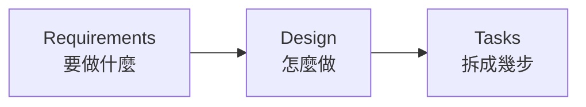

# OpenSpec

## 讓 AI 知道什麼叫「完成」

從 Vibe Coding 到規格驅動開發

<div class="abs-bl m-6 text-sm text-gray-400">
  Amo Wu · 2026-08-03
</div>

---
layout: section
---

# 1 · AI 說「我做完了」

---
layout: center
---

# 「我做完了」

<div class="text-4xl mt-8 text-gray-400">
  ——完成了什麼？
</div>

---

# Vibe Coding 的甜蜜

憑感覺寫程式，邊做邊想。而且它真的有效——在對的場景裡。

- **POC 驗證**　想法能不能成立，一個下午就知道
- **一次性小工具**　寫完就丟，沒有維護成本
- **技術探索**　不熟的函式庫，先跑起來再說

<div class="mt-8 text-gray-400">
  這些場景的共同點：專案小、只有你一個人、活不過下週。
</div>

---

# Vibe Coding 的危險

專案變大、需求變複雜、團隊變多人之後，三個問題會浮出來。

<v-clicks>

- **程式碼風格不一致**　同一個功能，這次用 hook、下次用 HOC
- **AI 漏掉你沒說出口的需求**　你以為的「當然要處理」，AI 不會主動問
- **AI 自信地宣稱完成**　「我做完了」——但邊界條件沒處理、測試沒補

</v-clicks>

---
layout: center
---

# 問題不在 AI 不夠強

<div class="text-2xl mt-6 text-gray-400">
  而在於，從頭到尾沒有人定義過
</div>

<div class="text-5xl mt-6 font-bold">
  什麼叫「完成」
</div>

---
layout: section
---

# 2 · SDD 是什麼

---

# SDD 不是新發明

Spec-Driven Development 的每一塊，我們其實都見過。

| 來源 | 借來的觀念 |
|---|---|
| 瀑布式開發 | 先把需求寫清楚再動工 |
| TDD | 先定義通過條件，再寫實作 |
| BDD | 用「當…則…」描述行為，而非實作細節 |

<div class="mt-8 text-gray-400">
  差別只在於：這次的讀者不只是人，還有 AI。
</div>

---
layout: center
---

# 規格是 AI 與人的共同語言

<div class="text-xl mt-8 text-gray-400">
  同一份文件，人拿來對齊認知，AI 拿來知道邊界在哪
</div>

---

# 三個階段

<v-clicks>



</v-clicks>

<div class="mt-8">

每一階段都是下一階段的輸入。跳過任何一段，後面就得靠猜。

</div>

---

# 階段一：Requirements

寫下**要做什麼**，以及**怎樣算做到了**。

```md
作為一個使用者，我希望能夠用 Email 和密碼登入，
這樣我就能存取我的個人資料。

驗收標準：
- 當使用者輸入正確的 Email 和密碼時，系統應將使用者導向首頁
- 當密碼錯誤超過三次時，系統應鎖定帳號三十分鐘
```

<div class="mt-6 text-gray-400">
  重點不是「使用者故事」這個格式，而是驗收標準——沒有它，「完成」就沒有定義。
</div>

---

# 階段二：Design

寫下**怎麼做**。目的是在寫程式之前就發現問題。

- 系統架構與資料流程
- 資料模型
- 錯誤處理策略
- 測試策略
- Wireframe（用 ASCII 畫也行）

<div class="mt-8 text-gray-400">
  在這一頁改一行字，比在程式碼裡改一天便宜。
</div>

---

# 階段三：Tasks

把工作拆成可追蹤的小任務。

- 每個任務有明確目標與驗收標準
- 每個任務能追溯回最初的需求
- 顆粒度因人而異——拆到「你有把握一次做對」為止

<div class="mt-8 text-gray-400">
  這份清單同時是進度表，也是 AI 的施工圖。
</div>

---

# EARS：讓需求可以被執行

**E**asy **A**pproach to **R**equirements **S**yntax

- 2009 年由 Alistair Mavin 與 Rolls-Royce 團隊提出
- Airbus、NASA、Siemens 等公司採用
- 目的：把自然語言需求壓縮成少數幾種固定句型

---

# EARS 的句型

```text
WHEN   the user enters correct email and password
THEN   the system SHALL redirect the user to the home page
```

<div class="mt-8">

`WHEN` 描述觸發條件，`THEN` 描述系統必須做的事，`SHALL` 表示這是強制要求。

</div>

---

# EARS 帶來的三件事

- **強迫需求明確化**　寫不出 `WHEN`，代表你還沒想清楚觸發條件
- **易於轉成測試**　一個 `WHEN / THEN` 就是一個測試案例
- **壓縮 AI 的猜測空間**　句型固定，語意就沒有解釋餘地

---

# SDD 的三個層級

不是所有人講的 SDD 都是同一件事。

```text
Spec-first      規格用完即丟
Spec-anchored   規格進版控，隨專案演進
Spec-as-source  程式碼完全由規格生成
```

---

# 三個層級的差別

| 層級 | 規格的下場 | 現況 |
|---|---|---|
| **Spec-first** | 實作完成後可丟棄 | 多數工具至少支援 |
| **Spec-anchored** | 進版控、持續更新；改功能先改規格 | 目前最務實 |
| **Spec-as-source** | 標記 `GENERATED FROM SPEC - DO NOT EDIT` | 仍在實驗階段 |

---
layout: center
---

# 今天談的是第二層

<div class="text-5xl mt-6 font-bold">
  Spec-anchored
</div>

<div class="text-xl mt-8 text-gray-400">
  規格進版控、隨專案演進，新人可以先讀規格再讀程式碼
</div>

---
layout: section
---

# 3 · 為什麼是 OpenSpec

---

# 工具地景

<div class="text-sm">

| 工具 | 工作流 | 特色 | 定位 |
|---|---|---|---|
| **Amazon Kiro** | Requirements → Design → Tasks | EARS、property-based testing、Hooks | Spec-first 為主 |
| **GitHub Spec Kit** | Constitution → Specify → Plan → Tasks | Constitution 定義原則、高度可客製 | Spec-first |
| **Tessl** | Plan / Spec / Test | 免費 Spec Registry，逾一萬個 OSS 用法規格 | 主打 Spec-as-source |
| **OpenSpec** | proposal → apply → archive | `specs` 與 `changes` 分離、純 Markdown | Spec-anchored |

</div>

---

# Greenfield 還是 Brownfield？

<div class="grid grid-cols-2 gap-8 mt-8">
<div>

### Greenfield

全新專案，沒有包袱。
從第一天就能把規格寫好。

</div>
<div>

### Brownfield

既有系統，滿地隱性規則。
改一個地方，得先知道會碰到什麼。

</div>
</div>

<div class="mt-10 text-center text-2xl">
  我們是後者。
</div>

---

# OpenSpec 的取捨

- **Brownfield-first**　`specs`（現在的系統長怎樣）與 `changes`（這次要改什麼）分離，強迫思考「這次變更會影響什麼」
- **全部是 Markdown**　進版控、走 PR review、不需要學新格式
- **不需要 API key**　不依賴雲端服務，沒有額外成本與資安評估
- **不綁 AI 工具**　Claude Code、Cursor、GitHub Copilot、Codex、Gemini CLI 都能用

---

# 我們試過 Spec Kit

`specs/001-time-basis-filter/` 還留在 repo 裡——只有這一個 feature。

```plain
specs/001-time-basis-filter/
├── checklists/requirements.md
├── data-model.md
├── plan.md
├── research.md
├── spec.md
└── tasks.md
```

<div class="mt-6 text-gray-400">
  六份文件、一次功能。流程完整，但對「改既有系統」這件事幫助有限——
  它沒有回答「現在的系統長怎樣」。
</div>

---
layout: section
---

# 4 · 實戰：三個指令

---
layout: section
---

# 5 · 現實：spec 不是銀彈

---
layout: section
---

# 6 · 怎麼開始

---
layout: center
---

# References

<div class="text-sm text-left">

- 高見龍，[SDD 規格驅動開發](https://kaochenlong.com/sdd-spec-driven-development)
- 高見龍，[OpenSpec 讓 SDD 變簡單的三個指令](https://kaochenlong.com/openspec)
- 高見龍，[Spec-as-source 的理想與現實](https://kaochenlong.com/sdd-spec-as-source)
- 高見龍，[給 AI 超能力？Superpowers 的設計與取捨](https://kaochenlong.com/ai-superpowers-skills)

<br>

- [OpenSpec](https://github.com/Fission-AI/OpenSpec) · `@fission-ai/openspec`
- [Superpowers](https://github.com/obra/superpowers)

</div>
