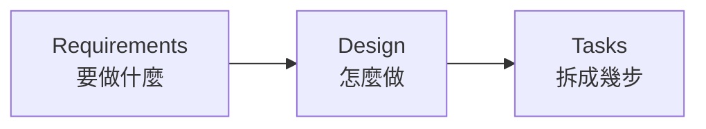
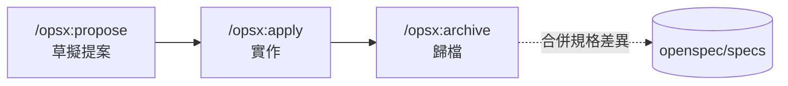

# OpenSpec 內部分享簡報 Implementation Plan

> **For agentic workers:** REQUIRED SUB-SKILL: Use superpowers:subagent-driven-development (recommended) or superpowers:executing-plans to implement this plan task-by-task. Steps use checkbox (`- [ ]`) syntax for tracking.

**Goal:** 產出 `2026-08-03-OpenSpec/slides.md`，一份 50 張的 Slidev 簡報，向 Hahow 內部工程團隊介紹並推廣 OpenSpec 規格驅動開發流程。

**Architecture:** 單一 Markdown 檔案，依設計文件的六章線性結構逐章建置。每個 task 完成一章、以 `scripts/count-slides.mjs` 驗證投影片數量與 layout、然後 commit。所有真實節錄以程式碼區塊呈現，內容一律取自 `/Users/amowu/Documents/Hahow/hahow-for-business-frontend` 的 change 紀錄，計畫中已附完整文字，實作時直接抄入即可，**不需要再去讀該 repo**。

**Tech Stack:** Slidev 52.15.0、`@slidev/theme-seriph` 0.25.0、Shiki、Mermaid（Slidev 內建）、Windi CSS 工具類。

## Global Constraints

- 檔案路徑固定為 `2026-08-03-OpenSpec/slides.md`，不建立其他簡報檔
- 全文繁體中文。OpenSpec 指令、Delta 關鍵字（`ADDED` / `MODIFIED` / `REMOVED`）、`WHEN` / `THEN` / `SHALL` / `MUST`、檔名與路徑一律保留原文
- 指令名稱一律使用 `/opsx:propose`、`/opsx:explore`、`/opsx:apply`、`/opsx:archive`（團隊實際使用的版本），**不可**寫成文章裡的 `/openspec:proposal`
- 每張投影片的節錄最多約 12 行；超過則以 `<div class="text-xs">` 包住
- 每則真實節錄都要標明來源路徑；同一個 change 連續數張時，於該段第一張標明完整路徑即可，後續張以檔名帶過
- `v-click` 只允許出現在三處：第 5 張（Vibe Coding 三個問題）、第 10 張（三階段流程圖）、第 33 張（Delta 三種標記）。其餘投影片一律靜態
- 不建立任何 `.vue` 元件檔，只用 Slidev 內建 layout 與 Windi 工具類
- 封面不設 `background`
- 投影片之間以獨立一行的 `---` 分隔；需要 per-slide frontmatter 時寫成 `---\nlayout: center\n---`

## 投影片編號對照

本計畫的「第 N 張」一律指 **parser 計數的實際位置**（含章節過場）。設計文件的「內容第 N 張」對照如下：

| 實際位置 | 內容 | 對應 task |
|---|---|---|
| 1 | 封面 | Task 1 |
| 2 | 第 1 章過場 | Task 1 |
| 3–6 | 內容 2–5 | Task 2 |
| 7 | 第 2 章過場 | Task 1 |
| 8–19 | 內容 6–17 | Task 3 |
| 20 | 第 3 章過場 | Task 1 |
| 21–24 | 內容 18–21 | Task 4 |
| 25 | 第 4 章過場 | Task 1 |
| 26–32 | 內容 22–28 | Task 5 |
| 33–38 | 內容 29–34 | Task 6 |
| 39 | 第 5 章過場 | Task 1 |
| 40–44 | 內容 35–39 | Task 7 |
| 45 | 第 6 章過場 | Task 1 |
| 46–49 | 內容 40–43 | Task 8 |
| 50 | References（內容 44） | Task 1 |

總計 50 張。

## File Structure

| 檔案 | 責任 |
|---|---|
| `2026-08-03-OpenSpec/slides.md` | 簡報全部內容（唯一交付物） |
| `2026-08-03-OpenSpec/public/` | 簡報專屬靜態資產。本計畫不放檔案，僅在 Task 8 建立 `.gitkeep` 供講者日後放截圖 |
| `scripts/count-slides.mjs` | 驗證工具：列出投影片數量與各張 layout / 標題 |

`2026-08-03-OpenSpec/` 資料夾已存在且內含空的 `slides.md`。

---

### Task 1: 簡報骨架與驗證工具

建立 frontmatter、封面、六張章節過場、References，形成可執行的 8 張骨架，後續 task 往中間填內容。

**Files:**
- Create: `scripts/count-slides.mjs`
- Modify: `2026-08-03-OpenSpec/slides.md`（目前為空檔）

**Interfaces:**
- Consumes:（無）
- Produces: `scripts/count-slides.mjs` — 執行 `node scripts/count-slides.mjs <path>`，第一行輸出 `slides: <數量>`，之後每行為 `<編號> | <layout> | <該張第一個 # 開頭的標題>`。後續每個 task 都以它驗證。

- [ ] **Step 1: 建立驗證工具**

建立 `scripts/count-slides.mjs`：

```javascript
// 列出指定簡報的投影片數量與各張的 layout / 標題，用於檢查大綱是否與設計一致。
// 用法：node scripts/count-slides.mjs 2026-08-03-OpenSpec/slides.md
import { readFile } from 'node:fs/promises'
import { parse } from '@slidev/parser'

const file = process.argv[2]
if (!file) {
  console.error('用法：node scripts/count-slides.mjs <path/to/slides.md>')
  process.exit(1)
}

const data = await parse(await readFile(file, 'utf-8'), file)
console.log(`slides: ${data.slides.length}`)
data.slides.forEach((slide, i) => {
  const heading = (slide.content || '').split('\n').find((line) => line.startsWith('#')) ?? ''
  const layout = slide.frontmatter?.layout ?? '-'
  console.log(`${String(i + 1).padStart(2)} | ${layout.padEnd(8)} | ${heading.slice(0, 44)}`)
})
```

- [ ] **Step 2: 驗證工具可用**

Run: `node scripts/count-slides.mjs 2026-05-11-DRM/slides.md | head -3`

Expected: 第一行為 `slides: 47`，第二行為 ` 1 | -        | # Hahow 如何保護串流內容（下）`

- [ ] **Step 3: 寫入骨架**

將 `2026-08-03-OpenSpec/slides.md` 的內容整個替換為：

````markdown
---
theme: seriph
title: OpenSpec：讓 AI 知道什麼叫「完成」
info: 從 Vibe Coding 到規格驅動開發 —— OpenSpec 在 hahow-for-business-frontend 的實踐
class: text-center
highlighter: shiki
drawings:
  persist: false
transition: slide-left
---

# OpenSpec

## 讓 AI 知道什麼叫「完成」

從 Vibe Coding 到規格驅動開發

<div class="abs-bl m-6 text-sm text-gray-400">
  Amo Wu · 2026-08-03
</div>

---
layout: section
---

# 1 · AI 說「我做完了」

---
layout: section
---

# 2 · SDD 是什麼

---
layout: section
---

# 3 · 為什麼是 OpenSpec

---
layout: section
---

# 4 · 實戰：三個指令

---
layout: section
---

# 5 · 現實：spec 不是銀彈

---
layout: section
---

# 6 · 怎麼開始

---
layout: center
---

# References

<div class="text-sm text-left">

- 高見龍，[SDD 規格驅動開發](https://kaochenlong.com/sdd-spec-driven-development)
- 高見龍，[OpenSpec 讓 SDD 變簡單的三個指令](https://kaochenlong.com/openspec)
- 高見龍，[Spec-as-source 的理想與現實](https://kaochenlong.com/sdd-spec-as-source)
- 高見龍，[給 AI 超能力？Superpowers 的設計與取捨](https://kaochenlong.com/ai-superpowers-skills)

<br>

- [OpenSpec](https://github.com/Fission-AI/OpenSpec) · `@fission-ai/openspec`
- [Superpowers](https://github.com/obra/superpowers)

</div>
````

- [ ] **Step 4: 驗證骨架**

Run: `node scripts/count-slides.mjs 2026-08-03-OpenSpec/slides.md`

Expected: `slides: 8`，且第 2、3、4、5、6、7 張的 layout 為 `section`，第 8 張為 `center`。

- [ ] **Step 5: Commit**

```bash
git add scripts/count-slides.mjs 2026-08-03-OpenSpec/slides.md
git commit -m "feat(openspec-slides): 建立簡報骨架與投影片計數工具"
```

---

### Task 2: 第 1 章 — 開場

**Files:**
- Modify: `2026-08-03-OpenSpec/slides.md`

**Interfaces:**
- Consumes: Task 1 的骨架，第 2 張為 `# 1 · AI 說「我做完了」` 過場
- Produces: 第 3–6 張內容。第 4 張是全簡報三處 `v-click` 的第一處。

- [ ] **Step 1: 插入四張投影片**

在第 2 張（`# 1 · AI 說「我做完了」`）之後、第 3 張（`# 2 · SDD 是什麼`）之前插入：

````markdown
---
layout: center
---

# 「我做完了」

<div class="text-4xl mt-8 text-gray-400">
  ——完成了什麼？
</div>

---

# Vibe Coding 的甜蜜

憑感覺寫程式，邊做邊想。而且它真的有效——在對的場景裡。

- **POC 驗證**　想法能不能成立，一個下午就知道
- **一次性小工具**　寫完就丟，沒有維護成本
- **技術探索**　不熟的函式庫，先跑起來再說

<div class="mt-8 text-gray-400">
  這些場景的共同點：專案小、只有你一個人、活不過下週。
</div>

---

# Vibe Coding 的危險

專案變大、需求變複雜、團隊變多人之後，三個問題會浮出來。

<v-clicks>

- **程式碼風格不一致**　同一個功能，這次用 hook、下次用 HOC
- **AI 漏掉你沒說出口的需求**　你以為的「當然要處理」，AI 不會主動問
- **AI 自信地宣稱完成**　「我做完了」——但邊界條件沒處理、測試沒補

</v-clicks>

---
layout: center
---

# 問題不在 AI 不夠強

<div class="text-2xl mt-6 text-gray-400">
  而在於，從頭到尾沒有人定義過
</div>

<div class="text-5xl mt-6 font-bold">
  什麼叫「完成」
</div>
````

- [ ] **Step 2: 驗證張數與 layout**

Run: `node scripts/count-slides.mjs 2026-08-03-OpenSpec/slides.md`

Expected: `slides: 12`。第 3 張 layout 為 `center`、標題 `# 「我做完了」`；第 4 張 `# Vibe Coding 的甜蜜`；第 5 張 `# Vibe Coding 的危險`；第 6 張 layout `center`、標題 `# 問題不在 AI 不夠強`；第 7 張為 `# 2 · SDD 是什麼` 過場。

- [ ] **Step 3: Commit**

```bash
git add 2026-08-03-OpenSpec/slides.md
git commit -m "feat(openspec-slides): 第 1 章 開場"
```

---

### Task 3: 第 2 章 — SDD 是什麼

本章 12 張，是純概念章節，講述 6 分鐘。

**Files:**
- Modify: `2026-08-03-OpenSpec/slides.md`

**Interfaces:**
- Consumes: Task 2 完成後的 12 張，第 7 張為 `# 2 · SDD 是什麼` 過場
- Produces: 第 8–19 張。第 10 張是三處 `v-click` 的第二處，且是全簡報第一張 Mermaid 圖。

- [ ] **Step 1: 插入十二張投影片**

在第 7 張（`# 2 · SDD 是什麼`）之後、`# 3 · 為什麼是 OpenSpec` 之前插入：

````markdown
---

# SDD 不是新發明

Spec-Driven Development 的每一塊，我們其實都見過。

| 來源 | 借來的觀念 |
|---|---|
| 瀑布式開發 | 先把需求寫清楚再動工 |
| TDD | 先定義通過條件，再寫實作 |
| BDD | 用「當…則…」描述行為，而非實作細節 |

<div class="mt-8 text-gray-400">
  差別只在於：這次的讀者不只是人，還有 AI。
</div>

---
layout: center
---

# 規格是 AI 與人的共同語言

<div class="text-xl mt-8 text-gray-400">
  同一份文件，人拿來對齊認知，AI 拿來知道邊界在哪
</div>

---

# 三個階段

<v-clicks>



</v-clicks>

<div class="mt-8">

每一階段都是下一階段的輸入。跳過任何一段，後面就得靠猜。

</div>

---

# 階段一：Requirements

寫下**要做什麼**，以及**怎樣算做到了**。

```md
作為一個使用者，我希望能夠用 Email 和密碼登入，
這樣我就能存取我的個人資料。

驗收標準：
- 當使用者輸入正確的 Email 和密碼時，系統應將使用者導向首頁
- 當密碼錯誤超過三次時，系統應鎖定帳號三十分鐘
```

<div class="mt-6 text-gray-400">
  重點不是「使用者故事」這個格式，而是驗收標準——沒有它，「完成」就沒有定義。
</div>

---

# 階段二：Design

寫下**怎麼做**。目的是在寫程式之前就發現問題。

- 系統架構與資料流程
- 資料模型
- 錯誤處理策略
- 測試策略
- Wireframe（用 ASCII 畫也行）

<div class="mt-8 text-gray-400">
  在這一頁改一行字，比在程式碼裡改一天便宜。
</div>

---

# 階段三：Tasks

把工作拆成可追蹤的小任務。

- 每個任務有明確目標與驗收標準
- 每個任務能追溯回最初的需求
- 顆粒度因人而異——拆到「你有把握一次做對」為止

<div class="mt-8 text-gray-400">
  這份清單同時是進度表，也是 AI 的施工圖。
</div>

---

# EARS：讓需求可以被執行

**E**asy **A**pproach to **R**equirements **S**yntax

- 2009 年由 Alistair Mavin 與 Rolls-Royce 團隊提出
- Airbus、NASA、Siemens 等公司採用
- 目的：把自然語言需求壓縮成少數幾種固定句型

---

# EARS 的句型

```text
WHEN   the user enters correct email and password
THEN   the system SHALL redirect the user to the home page
```

<div class="mt-8">

`WHEN` 描述觸發條件，`THEN` 描述系統必須做的事，`SHALL` 表示這是強制要求。

</div>

---

# EARS 帶來的三件事

- **強迫需求明確化**　寫不出 `WHEN`，代表你還沒想清楚觸發條件
- **易於轉成測試**　一個 `WHEN / THEN` 就是一個測試案例
- **壓縮 AI 的猜測空間**　句型固定，語意就沒有解釋餘地

---

# SDD 的三個層級

不是所有人講的 SDD 都是同一件事。

```text
Spec-first      規格用完即丟
Spec-anchored   規格進版控，隨專案演進
Spec-as-source  程式碼完全由規格生成
```

---

# 三個層級的差別

| 層級 | 規格的下場 | 現況 |
|---|---|---|
| **Spec-first** | 實作完成後可丟棄 | 多數工具至少支援 |
| **Spec-anchored** | 進版控、持續更新；改功能先改規格 | 目前最務實 |
| **Spec-as-source** | 標記 `GENERATED FROM SPEC - DO NOT EDIT` | 仍在實驗階段 |

---
layout: center
---

# 今天談的是第二層

<div class="text-5xl mt-6 font-bold">
  Spec-anchored
</div>

<div class="text-xl mt-8 text-gray-400">
  規格進版控、隨專案演進，新人可以先讀規格再讀程式碼
</div>
````

- [ ] **Step 2: 驗證張數與 layout**

Run: `node scripts/count-slides.mjs 2026-08-03-OpenSpec/slides.md`

Expected: `slides: 24`。第 8 張 `# SDD 不是新發明`；第 9 張 layout `center`；第 10 張 `# 三個階段`；第 19 張 layout `center`、標題 `# 今天談的是第二層`；第 20 張為 `# 3 · 為什麼是 OpenSpec` 過場。

- [ ] **Step 3: 目視確認 Mermaid 圖有算繪**

Run: `npm run dev -- 2026-08-03-OpenSpec/slides.md`

在瀏覽器開啟第 10 張，確認 Mermaid 流程圖三個節點正常顯示、且按一次方向鍵後才出現（`v-click`）。確認後按 `Ctrl+C` 結束 dev server。

- [ ] **Step 4: Commit**

```bash
git add 2026-08-03-OpenSpec/slides.md
git commit -m "feat(openspec-slides): 第 2 章 SDD 概念"
```

---

### Task 4: 第 3 章 — 為什麼是 OpenSpec

**Files:**
- Modify: `2026-08-03-OpenSpec/slides.md`

**Interfaces:**
- Consumes: Task 3 完成後的 24 張，第 20 張為 `# 3 · 為什麼是 OpenSpec` 過場
- Produces: 第 21–24 張

- [ ] **Step 1: 插入四張投影片**

在第 20 張之後、`# 4 · 實戰：三個指令` 之前插入：

````markdown
---

# 工具地景

<div class="text-sm">

| 工具 | 工作流 | 特色 | 定位 |
|---|---|---|---|
| **Amazon Kiro** | Requirements → Design → Tasks | EARS、property-based testing、Hooks | Spec-first 為主 |
| **GitHub Spec Kit** | Constitution → Specify → Plan → Tasks | Constitution 定義原則、高度可客製 | Spec-first |
| **Tessl** | Plan / Spec / Test | 免費 Spec Registry，逾一萬個 OSS 用法規格 | 主打 Spec-as-source |
| **OpenSpec** | proposal → apply → archive | `specs` 與 `changes` 分離、純 Markdown | Spec-anchored |

</div>

---

# Greenfield 還是 Brownfield？

<div class="grid grid-cols-2 gap-8 mt-8">
<div>

### Greenfield

全新專案，沒有包袱。
從第一天就能把規格寫好。

</div>
<div>

### Brownfield

既有系統，滿地隱性規則。
改一個地方，得先知道會碰到什麼。

</div>
</div>

<div class="mt-10 text-center text-2xl">
  我們是後者。
</div>

---

# OpenSpec 的取捨

- **Brownfield-first**　`specs`（現在的系統長怎樣）與 `changes`（這次要改什麼）分離，強迫思考「這次變更會影響什麼」
- **全部是 Markdown**　進版控、走 PR review、不需要學新格式
- **不需要 API key**　不依賴雲端服務，沒有額外成本與資安評估
- **不綁 AI 工具**　Claude Code、Cursor、GitHub Copilot、Codex、Gemini CLI 都能用

---

# 我們試過 Spec Kit

`specs/001-time-basis-filter/` 還留在 repo 裡——只有這一個 feature。

```plain
specs/001-time-basis-filter/
├── checklists/requirements.md
├── data-model.md
├── plan.md
├── research.md
├── spec.md
└── tasks.md
```

<div class="mt-6 text-gray-400">
  六份文件、一次功能。流程完整，但對「改既有系統」這件事幫助有限——
  它沒有回答「現在的系統長怎樣」。
</div>
````

- [ ] **Step 2: 驗證張數**

Run: `node scripts/count-slides.mjs 2026-08-03-OpenSpec/slides.md`

Expected: `slides: 28`。第 21 張 `# 工具地景`；第 24 張 `# 我們試過 Spec Kit`；第 25 張為 `# 4 · 實戰：三個指令` 過場。

- [ ] **Step 3: Commit**

```bash
git add 2026-08-03-OpenSpec/slides.md
git commit -m "feat(openspec-slides): 第 3 章 工具地景"
```

---

### Task 5: 第 4 章前半 — 安裝、流程與 proposal

本章共 13 張，拆成兩個 task。前半七張講到 proposal 的產物結構。

**Files:**
- Modify: `2026-08-03-OpenSpec/slides.md`

**Interfaces:**
- Consumes: Task 4 完成後的 28 張，第 25 張為 `# 4 · 實戰：三個指令` 過場
- Produces: 第 26–32 張。第 29–31 張引用 `2026-06-26-quiz-multiple-choice` 的 `proposal.md`，Task 6 的第 34 張會延續引用同一個 change 的 `specs/quiz-taking-page/spec.md`。

- [ ] **Step 1: 插入七張投影片**

在第 25 張之後插入：

````markdown
---

# 安裝與初始化

```bash
npm install -g @fission-ai/openspec@latest
cd my-project
openspec init
```

初始化後的結構：

```plain
openspec/
├── config.yaml
├── specs/      # 系統現在長什麼樣（正式規格）
└── changes/
    └── archive/  # 已完成的變更
```

---

# 三個指令



<div class="mt-6 text-gray-400">
  另有 <code>/opsx:explore</code> 用於動手前先摸清既有實作。
</div>

---

# Stage 1 · propose

```bash
/opsx:propose 測驗支援複選題
```

產出一個變更資料夾：

```plain
openspec/changes/2026-06-26-quiz-multiple-choice/
├── proposal.md   # 為什麼做、改什麼、影響什麼
├── design.md     # 技術決策與取捨
├── tasks.md      # 拆好的任務清單
└── specs/        # 這次變更對規格的 delta
```

---

# proposal.md · Why

<div class="text-xs">

```md
## Why

平台測驗目前只支援「單選題」，學員每題只能選一個答案，無法評估需要
同時掌握多個正確觀念的情境（法規確認、多步驟流程判斷、安全操作規範）。
後端已預先實作複選題的資料模型與評分邏輯，前端 Admin 也已寫好 Checkbox UI
但暫時封印待開放——本次為「解除封印」，補上缺失的 Admin 設置與學員端
作答／結果頁呈現。
```

</div>

<div class="mt-4 text-gray-400 text-sm">
  來源：<code>openspec/changes/archive/2026-06-26-quiz-multiple-choice/proposal.md</code>
</div>

---

# proposal.md · What Changes

<div class="text-xs">

```md
- **Admin 題目編輯**：解除封印「＋ 複選題」新增按鈕與每道題目的
  「題目類型」Select（單選 ↔︎ 複選）；複選題以 Checkbox 標示多個正確答案、
  單選題維持 Radio（現有行為）。
- **Admin 送出驗證**：複選題至少須標示一個正確答案；選項至少保留 2 個。
- **學員端作答頁**：複選題以 Checkbox 呈現、可同時勾選／取消多個選項，
  並在題號旁顯示「複選」標籤。
- **範圍界定**：本次僅實作 Web（Admin + 學員端）；App 由 mobile 團隊另行實作。
  前端不自行計算分數，僅呈現後端回傳的分數與各選項結果。
```

</div>

<div class="mt-4 text-gray-400 text-sm">
  注意最後一段——<strong>寫下不做什麼</strong>，跟寫下要做什麼一樣重要。
</div>

---

# proposal.md · Capabilities

這一段決定了 delta 要寫進哪幾份規格。

<div class="text-xs">

```md
### New Capabilities
- `quiz-question-editor`: Admin 測驗單元編輯頁的題目編輯能力——新增題目
  （單選／複選）、題目類型切換、選項管理與正確答案標示、送出前驗證。

### Modified Capabilities
- `quiz-taking-page`: 新增複選題作答行為——Checkbox 多選/取消、「複選」
  題型標籤、含複選題的送出按鈕啟用條件、複選 choiceIds 提交格式。
- `quiz-result-page`: 新增複選題結果呈現——四象限選項上色、全對全錯
  badge、「正確答案」純文字區塊。
```

</div>

---

# 對應的 specs 結構

一個 capability 一個資料夾，各自一份 `spec.md`。

```plain
openspec/changes/2026-06-26-quiz-multiple-choice/specs/
├── quiz-question-editor/spec.md   # ADDED
├── quiz-taking-page/spec.md       # MODIFIED
└── quiz-result-page/spec.md       # MODIFIED
```

<div class="mt-8 text-gray-400">
  跨模組的變更不會被壓成一份大文件，而是各自落在它影響的能力上。
</div>
````

- [ ] **Step 2: 驗證張數**

Run: `node scripts/count-slides.mjs 2026-08-03-OpenSpec/slides.md`

Expected: `slides: 35`。第 26 張 `# 安裝與初始化`；第 27 張 `# 三個指令`；第 32 張 `# 對應的 specs 結構`。

- [ ] **Step 3: 目視確認第二張 Mermaid 圖**

Run: `npm run dev -- 2026-08-03-OpenSpec/slides.md`

開啟第 27 張，確認流程圖四個節點與虛線都正常顯示（此張**不**應有 click 動畫）。確認後按 `Ctrl+C`。

- [ ] **Step 4: Commit**

```bash
git add 2026-08-03-OpenSpec/slides.md
git commit -m "feat(openspec-slides): 第 4 章前半 安裝流程與 proposal"
```

---

### Task 6: 第 4 章後半 — Delta、Scenario、apply / archive

**Files:**
- Modify: `2026-08-03-OpenSpec/slides.md`

**Interfaces:**
- Consumes: Task 5 完成後的 35 張，最後一張為 `# 對應的 specs 結構`
- Produces: 第 33–38 張。第 36 張是三處 `v-click` 的第三處，也是最後一處。

- [ ] **Step 1: 插入六張投影片**

在第 32 張（`# 對應的 specs 結構`）之後、`# 5 · 現實：spec 不是銀彈` 過場之前插入：

````markdown
---

# Delta 格式

變更的規格不是重寫整份，而是描述「差異」。

<v-clicks>

```md
## ADDED Requirements
### Requirement: 新增題目按鈕支援單選與複選
```

```md
## MODIFIED Requirements
### Requirement: 依題目類型渲染選項元件
（寫出完整的修改後內容，不是只寫改動處）
```

```md
## REMOVED Requirements
### Requirement: Password Reset via Email
**Reason**: 改用更安全的驗證方式
```

</v-clicks>

---

# Scenario 的寫法

每個 Requirement **至少要有一個 Scenario**，強制性用 `SHALL` 或 `MUST`。

<div class="text-xs">

```md
### Requirement: 複選題顯示「複選」題型標籤

作答頁 SHALL 在複選題「問題 n」（題號）右側、同列顯示「複選」標籤；
單選題 SHALL NOT 顯示題型標籤。

#### Scenario: 複選題顯示「複選」標籤（AC-EXAM-03）

- **WHEN** 學員進入作答頁且測驗包含複選題
- **THEN** 系統應在複選題「問題 n」右側顯示「複選」標籤，單選題不顯示
```

</div>

<div class="mt-4 text-gray-400 text-sm">
  來源：<code>.../quiz-multiple-choice/specs/quiz-taking-page/spec.md</code>　括號裡的
  <code>AC-EXAM-03</code> 是 PRD 的驗收條件編號——規格可以直接追溯回需求。
</div>

---

# Stage 2 · apply

```bash
/opsx:apply quiz-multiple-choice
```

AI 依 `tasks.md` 逐項完成，做完一項勾一項。

<div class="text-xs mt-4">

```md
## 1. GraphQL 契約與型別

- [x] 1.1 學員端 gql 的三處 questions 補上 questionType
- [x] 1.2 responses 由 myChoice/correctChoice 改為 myChoices、correctChoices
- [x] 1.3 submitQuizPaper mutation 改以 ResponseInput.choiceIds 提交
- [x] 1.4 執行 yarn generate 並修正衍生型別錯誤
```

</div>

<div class="mt-4 text-gray-400 text-sm">
  規格在實作途中發現不對，就當場改規格——這是流程的一部分，不是失誤。
</div>

---

# Stage 3 · archive

```bash
/opsx:archive quiz-multiple-choice
```

做兩件事：

- 把變更資料夾移進 `openspec/changes/archive/`
- 把 delta 合併回 `openspec/specs/`，成為系統的新現況

```plain
openspec/specs/
├── quiz-question-editor/spec.md   ← 新增
├── quiz-taking-page/spec.md       ← 更新
└── quiz-result-page/spec.md       ← 更新
```

---

# 另一個極端

不是每個提案都是 31 個 task。

<div class="text-xs">

```md
## Why

班次列表頁的「自動偵測狀態」篩選下拉，與表格欄位 AutoDetectionStatusCell
對相同狀態使用了不一致的文案：篩選器顯示「尚未開始／已結束／已結束（異常）」，
但欄位實際渲染「未開始／已停止／已停止＋異常」。同一狀態出現兩種說法會造成
使用者困惑。本次將篩選器文案對齊欄位的命名。
```

</div>

<div class="mt-4">

`2026-06-11-align-auto-detection-filter-labels`：**7 個 task、1 份 spec、純文案調整**。
同一套流程，從改三個下拉選單到 52 個 task 的大功能都撐得住。

</div>

---

# 什麼時候不需要提案？

判斷標準：**這次改動會不會讓系統行為跟 `specs` 裡寫的不一樣。**

不需要提案的情況：

- 修 bug（讓程式**符合**既有規格）
- 修錯字、調整格式
- 更新非破壞性的相依套件
- 為現有行為補測試

<div class="mt-6">

常用指令：

```bash
openspec list                      # 進行中的變更
openspec show <name>               # 看細節
openspec validate <name> --strict  # 檢查格式
openspec view                      # 互動式儀表板
```

</div>
````

- [ ] **Step 2: 驗證張數**

Run: `node scripts/count-slides.mjs 2026-08-03-OpenSpec/slides.md`

Expected: `slides: 41`。第 33 張 `# Delta 格式`；第 38 張 `# 什麼時候不需要提案？`；第 39 張為 `# 5 · 現實：spec 不是銀彈` 過場。

- [ ] **Step 3: 確認 v-click 總數為三處**

Run: `grep -n 'v-click' 2026-08-03-OpenSpec/slides.md`

Expected: 剛好三行，分別位於 `# Vibe Coding 的危險`、`# 三個階段`、`# Delta 格式` 三張之內（`<v-clicks>` 開頭標籤各一行；結束標籤 `</v-clicks>` 亦含 `v-click` 字樣，故實際輸出為六行——三組開闔標籤）。

- [ ] **Step 4: Commit**

```bash
git add 2026-08-03-OpenSpec/slides.md
git commit -m "feat(openspec-slides): 第 4 章後半 Delta 格式與 apply/archive"
```

---

### Task 7: 第 5 章 — 現實：spec 不是銀彈

**Files:**
- Modify: `2026-08-03-OpenSpec/slides.md`

**Interfaces:**
- Consumes: Task 6 完成後的 41 張，第 39 張為 `# 5 · 現實：spec 不是銀彈` 過場
- Produces: 第 40–44 張

- [ ] **Step 1: 插入五張投影片**

在第 39 張之後、`# 6 · 怎麼開始` 之前插入：

````markdown
---

# 同一份 spec，跑三次

功能都對，但程式碼結構每次都不一樣。

<div class="grid grid-cols-2 gap-8 mt-8">
<div>

### 「可以動就好」派

功能正常就好，細節差異可接受。

</div>
<div>

### 「結構一致性」派

長期下來 codebase 會越來越難維護。

</div>
</div>

<div class="mt-10 text-gray-400">
  LLM 是非確定性的。同樣的輸入，不保證同樣的輸出——這跟程式碼需要的確定性天生衝突。
</div>

---

# 自然語言天生曖昧

> 點擊按鈕顯示對話框

這句話沒有回答的問題：

- 是 modal 還是非 modal？
- 出現在畫面哪個位置？
- 裡面放什麼內容？
- 怎麼關閉？點外面算不算？
- 有沒有進場動畫？
- 手機上呢？
- 開啟時背景能不能捲動？

---

# 虛假的控制感

我們以為透過規格控制了 AI，但 AI 仍然在自己做決定。

- Model-Driven Development 有過同樣的願景，最後因為缺乏彈性而沒有普及
- 規格寫得越細，越接近「用自然語言寫程式」——而自然語言不擅長這件事
- 德文有個詞精準描述這個風險：**Verschlimmbesserung**，想改善卻讓事情變得更糟

---
layout: center
---

# 真正的價值，不是控制 AI

<div class="text-3xl mt-8">
  而是留下決策脈絡
</div>

<div class="text-lg mt-8 text-gray-400">
  程式碼會被重寫、被丟棄，但「當初為什麼這樣決定」不會自動留下來
</div>

---

# 一個真實的例子

`2026-07-23-fix-stale-session-signout`——客戶 subdomain 對調後約 50 人被鎖在登入頁。

<div class="text-xs mt-4">

```md
**範圍決定（PR #1544 review 後）**：原提案曾包含「登入頁切換帳號出口」。
經 code review 釐清，客戶實際遇到的死路完全由 signOutWithFlash 未帶 cookie
造成，修好登出即解決；「登入頁切換帳號」是一條客戶走不到的路徑，且屬於
未經 PM 確認的新產品行為，因此自本 change 移除。
```

```md
登出成功時 session cookie 不會消失。Rails 使用 cookie-based session store，
sign_out 是重設 session 並回一個新的空 session cookie。驗收應以「能否以
另一組帳號登入」為準，不可用「cookie 是否消失」判斷。
```

</div>

<div class="mt-4 text-gray-400 text-sm">
  上：proposal.md 記下砍掉一半範圍的理由。下：design.md 記下踩過才知道的驗收陷阱。<br>
  沒有這兩段，下一個人只會看到一個「為什麼只改了這麼一點」的 PR。
</div>
````

- [ ] **Step 2: 驗證張數**

Run: `node scripts/count-slides.mjs 2026-08-03-OpenSpec/slides.md`

Expected: `slides: 46`。第 40 張 `# 同一份 spec，跑三次`；第 43 張 layout `center`、標題 `# 真正的價值，不是控制 AI`；第 44 張 `# 一個真實的例子`；第 45 張為 `# 6 · 怎麼開始` 過場。

- [ ] **Step 3: Commit**

```bash
git add 2026-08-03-OpenSpec/slides.md
git commit -m "feat(openspec-slides): 第 5 章 限制與決策脈絡"
```

---

### Task 8: 第 6 章 — 怎麼開始，與整體驗收

最後四張內容，加上全簡報的建置驗證。

**Files:**
- Modify: `2026-08-03-OpenSpec/slides.md`
- Create: `2026-08-03-OpenSpec/public/.gitkeep`

**Interfaces:**
- Consumes: Task 7 完成後的 46 張，第 45 張為 `# 6 · 怎麼開始` 過場，第 46 張為 Task 1 建立的 References
- Produces: 完成的 50 張簡報

- [ ] **Step 1: 插入四張投影片**

在第 45 張（`# 6 · 怎麼開始`）之後、References 那張之前插入：

````markdown
---

# 怎麼導入

- **從下一個新功能開始**　不要回頭幫既有系統補 spec，那是無底洞
- **讓 archive 自然長出 specs**　每完成一個 change，`openspec/specs/` 就多一塊
- **提案進 PR review**　規格跟程式碼一起被 review，才會是活的
- **小改動也走一次**　7 個 task 的提案花不了多少時間，但它建立了習慣

---

# 三個月下來

`hahow-for-business-frontend`，2026-05-27 起。

| | |
|---|---|
| 累積 change | **16 個** |
| 正式 spec | **14 份** |
| 單一 change 規模 | **7 個 task** ～ **52 個 task** |

<div class="mt-8 text-gray-400">
  最小的是三個下拉選單文案，最大的是 assignment editor 的自動指派。
  同一套流程都撐得住。
</div>

---

# 延伸：Superpowers

規格解決 **what**，紀律解決 **how**。

Superpowers 是一套用 15 個 Skills 定義 AI 開發流程的框架：

- `brainstorming`　動手前先一次問一個問題，釐清需求
- `writing-plans`　假設執行者對專案一無所知，任務拆到 2–5 分鐘
- `test-driven-development`　沒先寫測試就不能寫 code
- `verification-before-completion`　宣稱完成前必須執行驗證指令，禁止用「應該」「大概」

---

# Superpowers 的取捨

- 依賴 AI 自律，沒有技術手段強制執行
- 成本高——subagent 模式每個任務開三個 session
- 適合高品質要求、長期維護的專案；不適合快速原型

<div class="mt-10 text-center">

<div class="text-2xl text-gray-400">下次 AI 說「我做完了」</div>

<div class="text-5xl mt-4 font-bold">反問它——完成了什麼？</div>

</div>
````

- [ ] **Step 2: 建立資產資料夾**

```bash
mkdir -p 2026-08-03-OpenSpec/public
touch 2026-08-03-OpenSpec/public/.gitkeep
```

供講者日後放 `openspec view` 與 `openspec validate --strict` 的截圖。

- [ ] **Step 3: 驗證最終張數**

Run: `node scripts/count-slides.mjs 2026-08-03-OpenSpec/slides.md`

Expected: `slides: 50`。第 46 張 `# 怎麼導入`；第 49 張 `# Superpowers 的取捨`；第 50 張 layout `center`、標題 `# References`。

- [ ] **Step 4: 驗證可以建置**

Run: `npx slidev build 2026-08-03-OpenSpec/slides.md --out "$(pwd)/dist/2026-08-03-OpenSpec"`

Expected: 建置成功，最後印出 `build complete`（或等效訊息）且無錯誤。此指令與 `.github/workflows` 部署流程使用的形式一致。

- [ ] **Step 5: 清掉建置產物**

```bash
rm -rf dist
```

`dist/` 不進版控。

- [ ] **Step 6: 全簡報目視檢查**

Run: `npm run dev -- 2026-08-03-OpenSpec/slides.md`

從頭翻到尾，確認：

- 兩張 Mermaid 圖（第 10、27 張）正常算繪
- 三處 click 動畫（第 5、10、33 張）各自運作
- 所有表格與程式碼區塊沒有超出畫面；若有溢出，把該張的 `<div>` 由 `text-sm` 改為 `text-xs`
- 第 50 張的連結可點擊

確認後按 `Ctrl+C`。

- [ ] **Step 7: Commit**

```bash
git add 2026-08-03-OpenSpec/slides.md 2026-08-03-OpenSpec/public/.gitkeep
git commit -m "feat(openspec-slides): 第 6 章 導入建議與 Superpowers 延伸"
```

---

## 完成後待辦（交付給講者）

計畫執行完畢後，簡報即可放映。以下兩項需要講者自己動手，不在本計畫範圍：

1. 於 `hahow-for-business-frontend` 執行 `openspec view`，截圖存為 `2026-08-03-OpenSpec/public/openspec-view.png`，並在第 38 張（`# 什麼時候不需要提案？`）之後加一張展示
2. 執行 `openspec validate <name> --strict`，截圖存為 `2026-08-03-OpenSpec/public/openspec-validate.png`，同上加一張

兩張截圖加入後總張數為 52。
